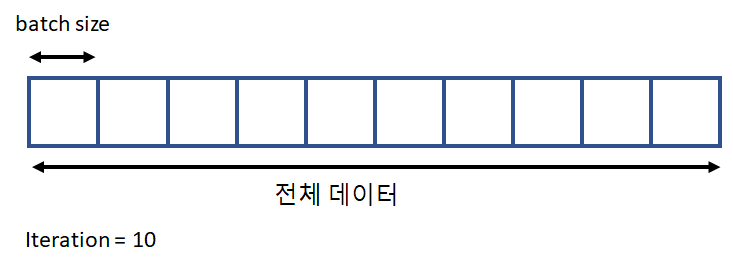

## 데이터 세분화를 통한 학습 효율

- 학습 과정 중 **최적화 (optimization)** 는 여러 번의 학습 과정을 거치며,
- 한 번의 학습 과정은 학습 데이터를 어떻게 나누냐에 따라 세분화 된다.

## epoch

- 전체 데이터 셋에 대하여 한 번 학습을 완료
  - 인공신경망 기본 알고리즘: 역전파 알고리즘 (forward pass + backward pass)
  - epoch 는 전체 데이터 셋에 대하여 forward pass 와 backward pass 가 완료된 상태
- epoch = 30 으로 설정하여 학습 → 전체 데이터를 30 번 사용하여 학습
- epoch 가 너무 큼 → overfitting
- epoch 가 너무 작음 → underfitting
    

## iteration / batch size

#### iteration
- 한 번의 학습 과정 (epoch) 에서 데이터를 몇번 나눠서 줄 것인가를 설정하는 변수
- epoch 를 몇번에 나누어서 실행할 것인지 결정
- **학습 영향**
  - 전체 데이터에 대한 오차 (cost) 총합을 가지고 backpropagation을 수행하면 weight가 한번에 크게 변할 수 있음
  - gradient의 이동 폭이 커서 global minimum을 지나칠 수도 있기에 gradient를 반복적으로 조금씩 이동하게 하는 역할을 수행

#### batch size  
- 각 iteration 마다 주는 데이터의 사이즈를 결정
- **학습 영향**
  - batch를 너무 작게하면 iteration이 증가하여 학습 시간(forward + backward propagation)이 증가할 수 있음

## summary
- Total Dataset = Batch Size \* mini batch
- 1 Epoch = Batch Size \* Iteration