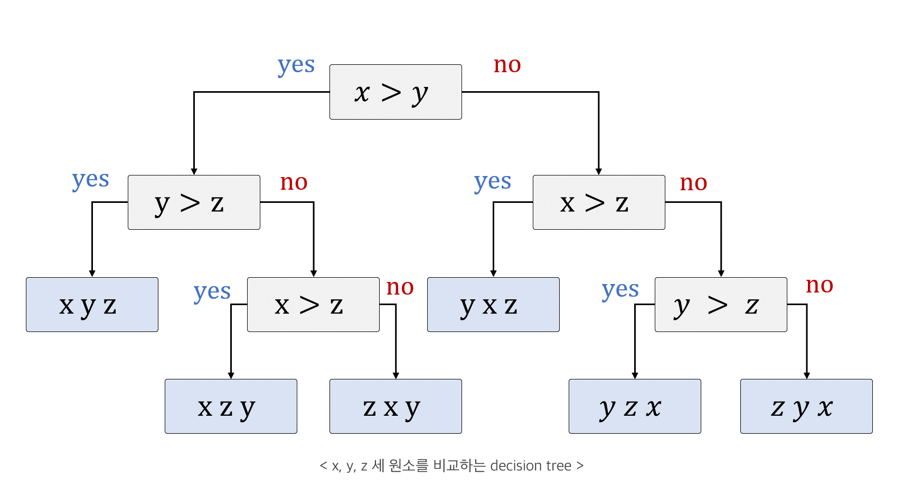

# 비교 정렬의 하한 (lower bound)

비교 정렬은 최악의 경우 수행 시간이 절대 $\omega(nlogn)$을 밑돌 수 없다.
임의의 비교 정렬은 결정 트리 (Decision tree) 에서 탐색으로 볼 수 있다. decision tree의 루트에서 시작해 리프에 이르면 정렬은 끝난다.

 
> 해당 이진 트리에서 최악의 경우 비교 횟수는 트리의 높이와 같다. 

</bn>

n개를 비교하는 decision tree에서 n개에 대한 모든 순열이 존재하기 때문에 리프 노드의 개수는 최대 n!가 존재한다.

$n!$에 대해서는 다음과 같은 스털링(stirling)의 근사식이 존재한다.
스털링 근사: 

