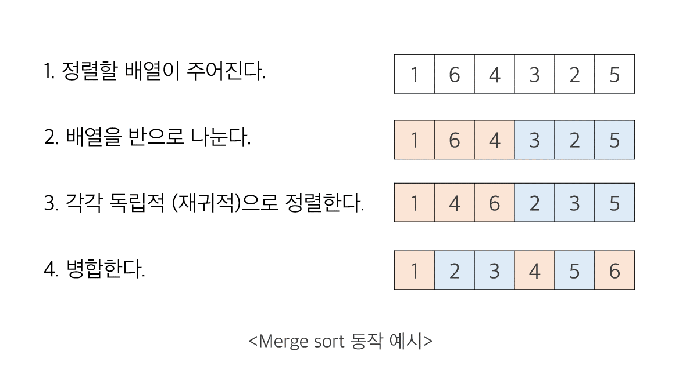
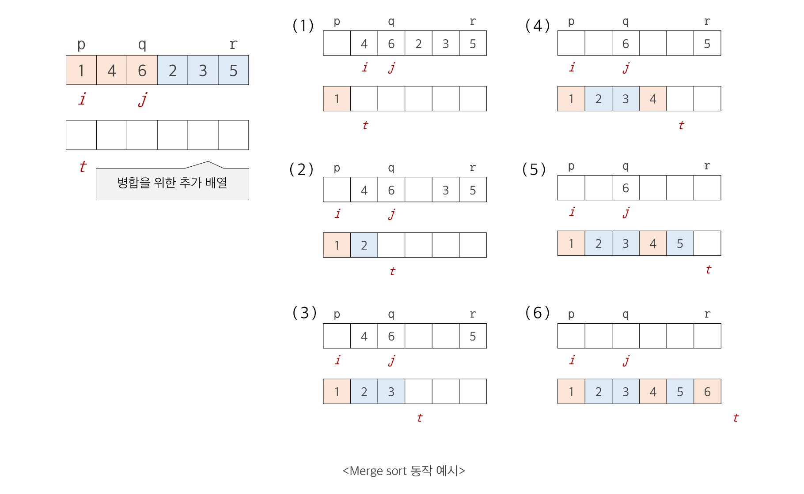
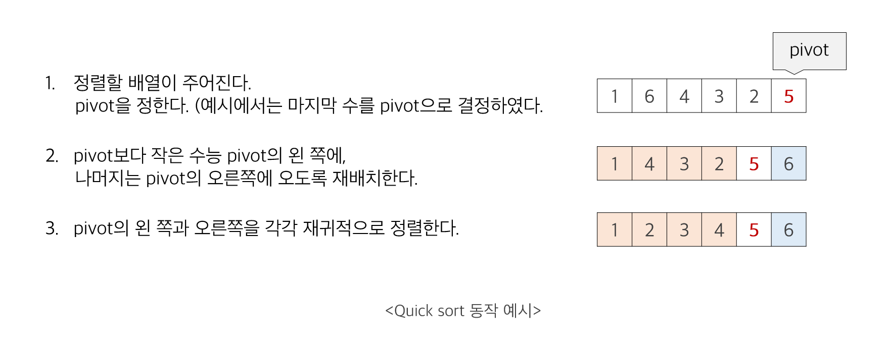
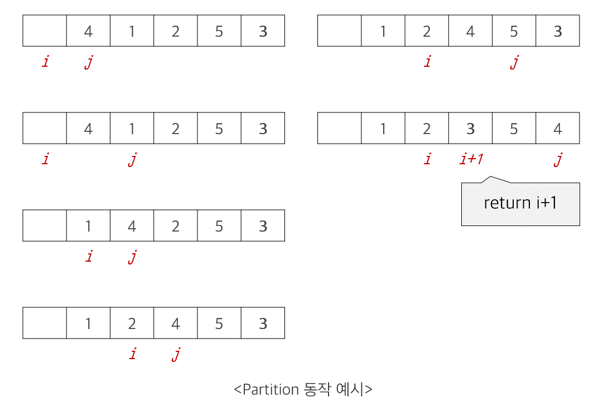
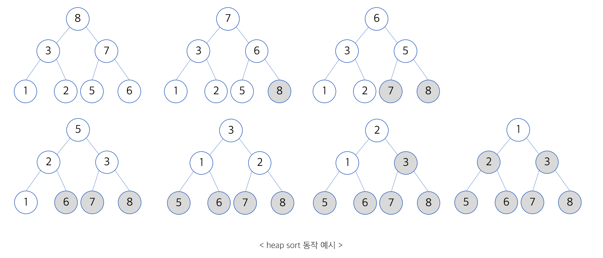

## 1. 정렬 알고리즘의 종류

### Comparison sort (비교 정렬)
- 데이터 간의 **상대적 크기 관계**만을 이용해서 정렬하는 알고리즘
- Selection sort, bubble sort, insertion sort, merge sort, quick sort, heap sort가 이에 해당한다.

- 기본 정렬 알고리즘
   - 시간 복잡도가  $O(n^2)$ 인 정렬 알고리즘
   - Selection sort (선택 정렬), Bubble sort (버블 정렬), Insertion sort (삽입 정렬)이 해당한다.
- 고급 정렬 알고리즘 
   - 시간 복잡도가 $O(nlogn)$인 정렬 알고리즘
   - Merge sort (병합 정렬), Quick sort (퀵 정렬), Heap sort(힙 정렬)이 해당한다.

### Non-Comparison sort
- 정렬할 데이터에 대한 **특수한 성질**을 이용하며 적용에 제한이 있다.
- counting sort, radix sort가 이에 해당한다.

- 특수 정렬 알고리즘 
   - 시간 복잡도가 $O(n)$인 알고리즘
   - counting sort (계수 정렬), Radix sort (기수 정렬)이 이에 해당한다.

> 특수 정렬 알고리즘은 해당 포스트에 기술하지 않았다.


## 2. 기본 정렬 알고리즘

- 시간 복잡도가  $O(n^2)$ 인 정렬 알고리즘

  

### 2.1. 선택 정렬 (Selection sort)

전체 입력 배열에 대해 차례대로 **최대값 또는 최소값**을 "**선택"** 하여 마지막 원소와 자리를 교환하여 정렬하는 알고리즘

1. 각 루프마다 최대 (또는 최소) 원소를 찾는다.

2. 최대 원소와 마지막 자리의 원소를 교환한다.

3. 마지막 자리의 원소 (이전 루프의 최대 원소)를 제외하고 하나의 원소만 남을 때까지 루프를 반복한다.

   ```c
   /*
   배열 A[1, ..., n] 을 정렬
   sort array A[1, ..., n]
   */
   selectionSort(A[], n){
     for last ← n downto 2{
       A[1 ... last] 중 가장 큰 수 A[k] 를 찾는다.
       swap(A[k], A[last]);
     }
   }
   ```

   

#### 수행 시간

- `line 6`: 루프는 `n-1` 번 반복 된다.
- `line 7`: 최댓 값을 찾기 위한 비교 횟수는 `n-1` 부터 `1`까지 이다.
- 원소 교환은 입력과는 관계없는 상수 시간 작업이다.
- $T(n) = (n-1) + (n-2) +... + 2 + 1 = n(n-1)/2 = O(n^2)$


#### Selection sort in C++

```cpp
void selectionSort(int A[], int n){
  for (int last = n - 1; last > 0; last--){

    /* 최댓값 찾기 (Search maxinum value in A[0, ..., last]) */
    int max_idx = 0;
    for (int i = 0; i < last+1; i++){
      max_idx = (A[max_idx] > A[i]) ? max_idx : i;  
      
      /* 최댓값을 가장 끝으로 이동 (Move max to end) */
      swap(A+max_idx, A+last);
      //  swap(&A[max_idx], &A[last]);
    }
  }
}
```


### 2.2. Bubble sort (버블 정렬)

연속된 인덱스의 숫자를 비교하여 큰 수를 뒤 쪽으로 이동시키는 과정을 반복하여 정렬하는 알고리즘

1. 현재 인덱스 [i] 값과 다음 인덱스 [i+1] 값을 비교한다.
2. 현재 인덱스의 값이 더 크다면 다음 인덱스와 교환한다.
3. 현재 인덱스의 값이 더 작다면, 교환하지 않고 넘어간다.
4. 루프를 한 바퀴 돌 때마다 가장 큰 값이 맨 뒤에 저장된다.

```c
/*
배열 A[1, ..., n] 을 정렬
sort array A[1, ..., n]
*/
bubbleSort(A[], n){
  for last ← n downto 2
    for i ← 1 to last-1
      if (A[i] > A[i+1]) then swap(A[i], A[i+1]);
}
```


#### 수행 시간

- `line 6` : 첫 번째 for 루프는 `n-1`번 반복된다.
- `line 7`: 두 번째 for 루프는 `n-1, n-2, ..., 2, 1` 번 반복된다.
- 원소 교환은 입력과는 관계없는 상수 시간 작업이다.
- $T(n) = (n-1) + (n-2) +... + 2 + 1 = n(n-1)/2 = O(n^2)$


#### Bubble sort in C++

```cpp
void bubbleSort(int data[], int n){
  for(int i=n-1; i>0; i--){
    for(int j=0; j<i; j++){
      /*이웃한 쌍을 비교하여, 순서가 잘못되어 있으면 자리 교환
      Compare adjacent items, and swap (if misordered)
      */
      if(data[j] > data[j+1])
        swap(data+j, data+j+1);
    }
  }
}
```


### 2.3. Insertion sort (삽입 정렬)

배열을 정렬된 부분 (앞 부분)과 정렬이 되지 않은 부분 (뒷 부분)으로 나누고, 정렬이 되지 않은 부분의  원소를 정렬된 부분의 적절한 위치에 "**삽입**"하여 정렬하는 알고리즘

1. 현재  인덱스 [i]를 기준으로 비교 인덱스 [1, ..., i-1] 를 잡는다.
2. [1, ..., i-1] 인덱스 값 중 [i] 인덱스의 값보다 큰 값이 있다면 해당 인덱스에 [i] 값을 삽입한다.

```c
/*
배열 A[1, ..., n] 을 정렬
sort array A[1, ..., n]
*/
insertionSort(A[], n){
  for i ← 2 to n{
    A[i-1] 부터 A[1] 까지 순서대로 비교하여 
      A[1, ..., i] 의 적절한 위치에 A[i]를 삽입
  }
}
```


#### 수행시간

- line 6: for 루프는 n-1번 반복된다.
- line 7-8:
  - 삽입을 위한 비교는 최악의 경우 i-1 번 발생한다.
  - 최선의 경우에는 1번만 비교할 수도 있다.
- 최악의 경우,
  - $T(n) = (n-1) + (n-2) +... + 2 + 1 = n(n-1)/2 = O(n^2)$
- 최선의 경우,
  - $T(n) = O(n)$


#### Insertion sort in C++

```c
void insertionSort(int data[], int n){
  for(int i=1; i<n+1; i++){
    for(int j=i; j>0; j--){
      if(data[j] < data[j-1]){
        /* 적절한 위치가 나올때까지 swap 하면서 원소 이동 */
        swap(data+j, data+j-1);
      }else{
        break;
      }
    }
  }
}
```


## 3. 고급 정렬 알고리즘

- 시간 복잡도가  $O(nlogn)$ 인 정렬 알고리즘
- merge sort, quick sort, heap sort이 이에 해당한다.
- 최악의 경우에도 merge sort 와 heap sort는 $O(nlogn)$이 소요되나 quick sort는 $O(n^2)$이 소요된다.
- quick sort는 최악의 경우 성능이 가장 나쁘나,  캐시 효율이 높기 때문에 다른 정렬보다 빠르다.
  - [퀵 정렬이 다른 정렬보다 빠른 이유](https://qastack.kr/cs/3/why-is-quicksort-better-than-other-sorting-algorithms-in-practice)

 

### 분할 정복법 (divide and conquer)

분할 정복법 (divide and conquer)은 여러 알고리즘의 기본이 되는 해결 방법으로 이를 사용하는 알고리즘에는 대표적으로 merge sort와 quick sort가 해당한다. 

- 알고리즘 설계 순서
  1. Divide (분할): 해결하고자 하는 문제를 작은 크기의 동일한 문제로 분할한다.
  2. Conquer (정복): 각각의 작은 문제를 재귀적으로 해결한다.
  3. Combine (취합): 작은 문제의 해를 합하여 원래 문제에 대한 해를 구한다.


### 3.1. Merge sort (병합 정렬)

1. Divide (분할): 데이터가 저장된 배열을 절반으로 나눈다.
2. Conquer (정복): 각각을 재귀적으로 정렬한다.
3. Combine (취합): 정렬된 두 개의 배열을 합쳐 전체를 정렬한다.

```c
// p: 배열 시작 인덱스
// r: 배열 끝 인덱스
mergeSort(A[], p, r){
  if (p < r) then {
    q <- (p + q)/2;
    mergeSort(A, p, q);
    mergeSort(A, q+1, r);
    merge(A, p, q, r);
  }
}

merge(A[], p, q, r){
  // 정렬되어 있는 두 배열 A[p...q]와 A[q+1...r]을 합하여
  // 정렬된 하나의 배열 A[p...r]을 생성
}
```

#### 동작 예시





#### 시간 복잡도

$$
\begin{aligned}

T(n) &= 2T(n/2) + n\\
T(1) &= 1\\

T(n)  &= 2T(n/2) + n\\
      &= 2(2T(n/2^2) + n/2) + n = 2^2T(n/2^2) + 2n\\
      &= 2^2(2T(n/2^3) + n/2^2) + n = 2^3T(n/2^3) + 3n\\
      & ...\\
      &= 2^kT(n/2^k) + kn\\
      &= nT(1) + nlogn\\
      &= n + nlogn = O(nlogn)

\end{aligned}
$$

#### Merge sort in C++

```cpp
// merge sort
void merge(int A[], int p, int q, int r){
  // 정렬되어 있는 두 배열 A[p...q]와 A[q+1...r]을 합하여
  // 정렬된 하나의 배열 A[p...r]을 만든다.

  int i = p, j = q+1;
  int idx = p;

  while (i < q+1 && j < r+1){
    if(A[i] < A[j]){  mergedArr[idx++] = A[i++];}
    else{             mergedArr[idx++] = A[j++];}
  }
  while(i < q+1){ // 왼쪽 부분 배열이 남은 경우
    mergedArr[idx++] = A[i++];
  }
  while(j < r+1){ // 오른쪽 부분 배열이 남은 경우
    mergedArr[idx++] = A[j++];
  }

  for(int i=p; i<r+1; i++){
    A[i] = mergedArr[i];  // copy mergedArr to A
  }
}

void mergeSort(int A[], int p, int r){
  if(p < r){
    int q = (p+r)/2;
    mergeSort(A, p, q);
    mergeSort(A, q+1, r);
    merge(A, p, q, r);
  }
}
```


### 3.2. Quick sort (퀵 정렬)

- 최악의 경우 다른 정렬 알고리즘보다 느리나, 평균적으로 merge sort, heap sort보다 빠르다.
- 어느 정도 균형 잡히게 분할만 된다면 $O(nlogn)$의 시간 복잡도를 가진다.


1. Divide (분할): 데이터가 저장된 배열을 특정 기준 (pivot)에 따라 두 부분으로 나눈다.
2. Conquer (정복): 각각을 재귀적으로 정렬한다.
3. Combine (취합): 필요없다.


```c
// p: 배열 시작 인덱스
// r: 배열 끝 인덱스
quickSort(A[], p, r){
  if(p < r) then{   
    q = partition(A, p, r);
    quickSort(A, p, q-1);
    quickSort(A, q+1, r);
  }
}

partition(A[], p, r){
  // 배열 A[p...r]의 원소들을 A[r]을 기준으로
  // 양쪽으로 재배치하고 A[r]이 자리한 위치를 반환한다.

  x = A[r];                     // 제일 왼 쪽에 있는 원소를 pivot으로 지정
  i = p-1;                      // i: pivot 보다 작은 값들 중 마지막 값

  for j=p to r-1{               // j: 현재 검사하려는 값
    if(A[j] < x) then{          // A[j]가 pivot보다 작으면
      i = i+1;                  // A[i+1]과 위치를 교환하고 다음 값을 검사한다.
      exchange A[i] and A[j];   
    }
  }
  exchange A[i+1] and A[r];     
  return i+1;                   // pivit이 자리한 위치를 반환한다.
}
```

#### 동작 예시






#### 시간 복잡도

- worst case:  항상 한 쪽은 0개, 다른 한 쪽은 n-1개로 분할되는 경우
  
  $$
  \begin{aligned}

  T(n) &= 2T(0) + T(n-1) + O(n)\\
  &= T(n-1) + O(n)\\
  &= T(n-2) + T(n-1) + O(n-1) + O(n)\\
  &...\\
  &= O(1) + O(2) + ... + O(n-1) + O(n) = O(n^2)

  \end{aligned}
  $$

- best case:  항상 절반으로 분할되는 경우

  $$
  \begin{aligned}
  T(n)  &= 2T(n/2) + O(n)
        &= O(nlogn)

  \end{aligned}
  $$

#### 피봇의 선택

- quick sort는 최악의 경우 시간 복잡도가 $O(n^2)$으로 다른 정렬 알고리즘보다 좋지 않은 성능을 가지나, 평균적으로 merge sort, heap sort에 비해 빠른 속도를 가진다.
- pivot에 의해 어느 정도 균형 잡히게 분할만 된다면 $O(nlogn)$의 시간 복잡도를 가지며 `pivot의 선택`에 따라 성능이 달라질 수 있다.


###### Median of Three

- 첫 번째 값과 마지막 값, 그리고 가운데 값 중에서 중간값 (median)을 pivot으로 사용하여 분할한다.
- 이 방법을 사용하면 중앙에서 분할될 가능성이 높아져 평균적인 정렬의 성능이 좋아진다.


#### Quick sort in C++

```cpp
// quick sort
int partition(int A[], int p, int r){
  // 배열 A[p...r] 의 원소들을 A[r]을 기준으로 
  // 양쪽으로 재배치하고 A[r]이 자리한 위치를 리턴

  int pivot = A[r], i = p-1;

  for(int j = p; j< r; j++){
    if(A[j] < pivot){
      i++;
      if(i != j) swap(&A[j], &A[i]);
    }
  } 
  swap(&A[r], &A[i+1]);
  
  return i+1;
}

void quickSort(int A[], int p, int r){
  if(p < r){
    int q = partition(A, p, r);
    quickSort(A, p, q-1);
    quickSort(A, q+1, r);
  }
}
```

### 3.3. Heap sort (힙 정렬)


#### Heap
- 완전 이진 트리 (complete binary tree)이면서 아래의 heap property를 만족하는 자료구조
  - 최소 힙 (min heap): 각 노드의 값이 자식 노드의 값보다 작거나 같다.
  - 최대 힙 (max heap): 각 노드의 값이 자식 노드의 값보다 크거나 같다.

#### Heap sort
- Heap 자료구조를 이용한 정렬 알고리즘으로 주어진 입력 데이터를 힙으로 만든 다음, 하나씩 힙에서 제거하면서 정렬한다.
- 최악의 경우에도 $O(nlogn)$의 시간 복잡도를 가진다.

#### Heap의 표현
- Heap은 A[1, ..., n]의 일차원 배열로 표현이 가능하다.
> [0, ..., n-1]로 표현하고 싶었는데 코드 짜는데 실패했다.
> 홀수 정의 (n = 2n+1) 때문에 불가한가?

```c
heapSort(A[], n){
  buildHeap(A, n);        // make heap
  for i <- n downto 2{
    exchange(A[1], A[i]); // heap 에서 제거하면서 정렬
    heapify(A, 1, i-1);   // heap 재구성 
  }
}

buildHeap(A[], n){
  for i <- n/2 downto 1
    heapify(A, i, n);
}


// A[k]를 루트로 하는 트리를 힙 성질을 만족하도록 수정하는 함수
// n: 전체 힙의 크기
heapify(A[], k, n){           
  left=2k; right=2k+1;

  if (right <= n) then{       // A[k]가 2개의 자식을 가지는 경우
    if (A[left] < A[right])) then{
      smaller = left;
    }
    else {
      smaller = right;
    }
  }
  else if (left <= n) then{   // A[k]가 1개의 자식을 가지는 경우
    smaller = left;
  }
  else{
    return;                   // A[k]가 자식이 없는 경우
  }

  if(A[smaller] < A[k]) then{
    exchange(A[k], A[smaller]); 
    heapify(A[], smaller, n);
  }
}
```

- `line 36`: 루트 노드가 자식 노드보다 큰 경우, 루트 노드와 자식 노드의 값을 바꾼다.
- `line 37`: 자식 노드를 루트로 재귀적으로 `heapify`를 수행한다.

#### 동작 예시




#### Heap sort in C++

```cpp
// sorting A[1, ..., n]
void heapSort(int A[], int n)
{
  buildHeap(A, n);
  for (int i = n; i > 1; i--)
  {
    swap(&A[1], &A[i]);
    heapify(A, 1, i - 1);
  }
}

void buildHeap(int A[], int n)
{
  for (int i = n / 2; i > 0; i--)
    heapify(A, i, n);
}

void heapify(int A[], int k, int n)
{
  int left = 2 * k, right = 2 * k + 1, max;

  if (right <= n)
    max = (A[left] > A[right]) ? left : right;
  else if (left <= n)
    max = left;
  else
    return;

  if (A[max] > A[k])
  {
    swap(&A[max], &A[k]);
    heapify(A, max, n);
  }
}
```
