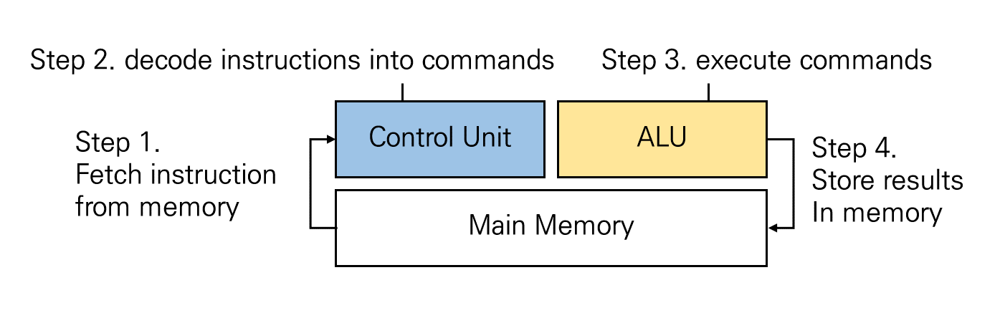
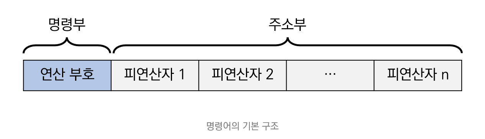
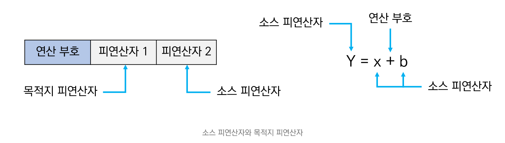
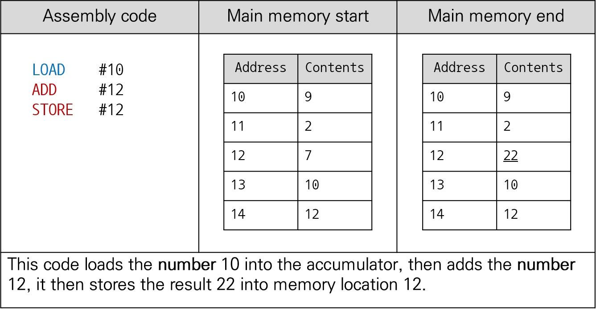
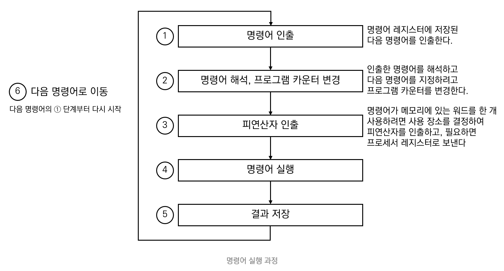
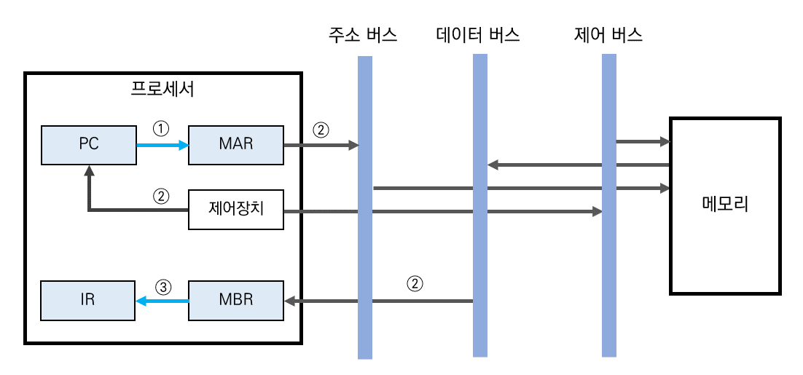
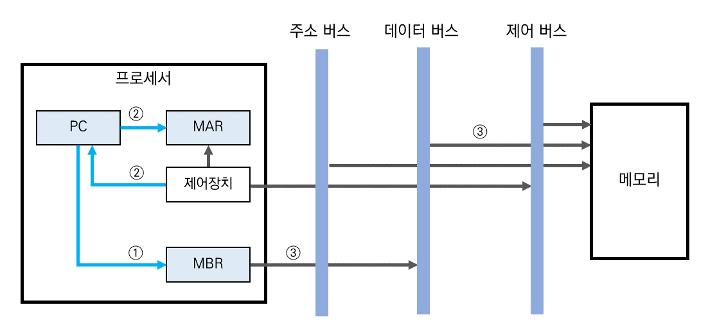
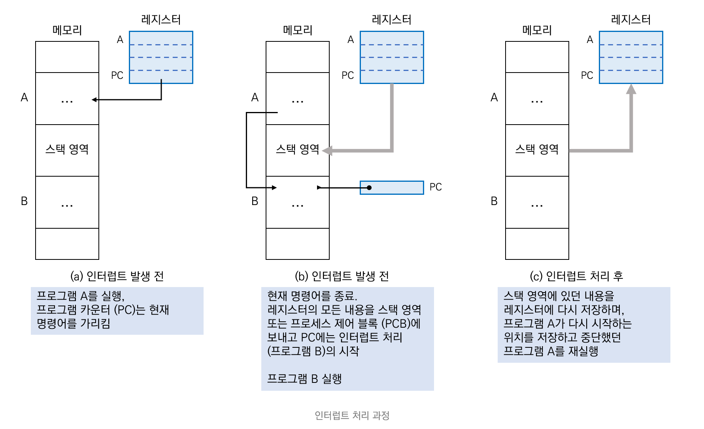

## Instructions

Interaction between processor and memory

- How a computer system runs a program?

  

- Instruction

  - A statement that specifies the operation of an arithmetic or logical operation to be performed by the processor

## 1. Instruction Structure

### Structure of instructions

 

#### OPcode

- 프로세서가 실행할 `operation`을 구체적으로 명시
- 산술 연산 (`+`, `-`, `*`, `/`), 논리 연산 (`AND`, `OR`, `NOT`), `shift`, etc.
- `operation code`가 `n bits`라면 `2^n` 개의 `operation` 이 수행 가능하다.

#### Operand

- Store (the address of) the data to be operated

  

#### Example

## 2. Instruction execution

#### Execution process

#### Instruction execution cycle

### 2.1. General case

| 시간 | 레지스터 동작    | 설명                                                         |
| ---- | ---------------- | ------------------------------------------------------------ |
| ①    | PC → MAR         | PC에 저장된 주소를 프로세서 내부 버스를 이용하여 MAR에 전달한다. |
| ②    | Memory^MAR → MBR | MAR에 저장된 주소에 해당하는 메모리 위치에서 명령어를 인출한 후  이 명령어를 MBR에 저장한다.   이때 제어장치는 메모리에 저장된 내용을 읽도록 제어 신호를 발생시킨다. |
|      | PC + 1 → PC      | 다음 명령어를 인출하려고 PC를 증가시킨다.                    |
| ③    | MBR → IR         | MBR에 저장된 내용을 IR에 전달한다.                           |

 

### 2.2. Interrupt case

| 시간 | 레지스터 동작           | 설명                                                  |
| ---- | ----------------------- | ----------------------------------------------------- |
| ①    | PC → MBR                | PC의 내용을 MBR에 저장한다.                           |
| ②    | IntRoutine_Address → PC | 인터럽트 루틴 주소를 PC에 저장한다.                   |
|      | Save_Address → MAR      | PC에 저장된 루틴 주소를 MAR에 저장한다.               |
| ③    | MBR → $Memory^MAR$      | MBR의 주소에 있는 내용을 지시된 메모리 셀로 이동한다. |

 

**인터럽트 처리 과정**

