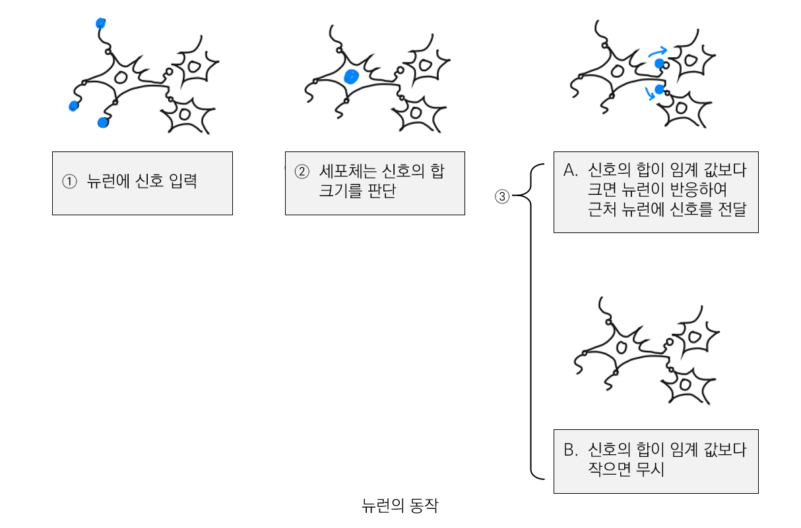
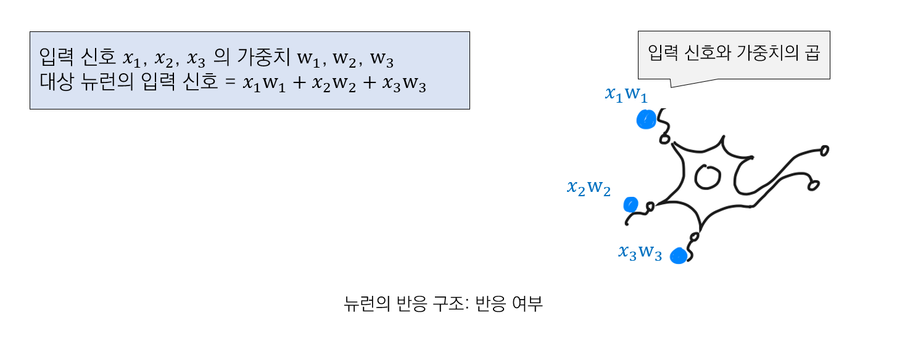
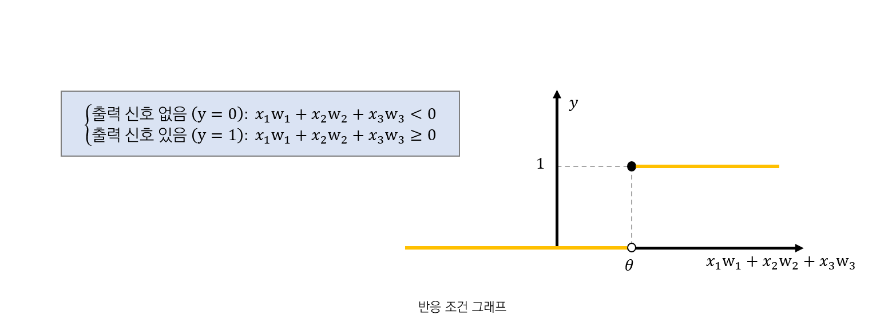
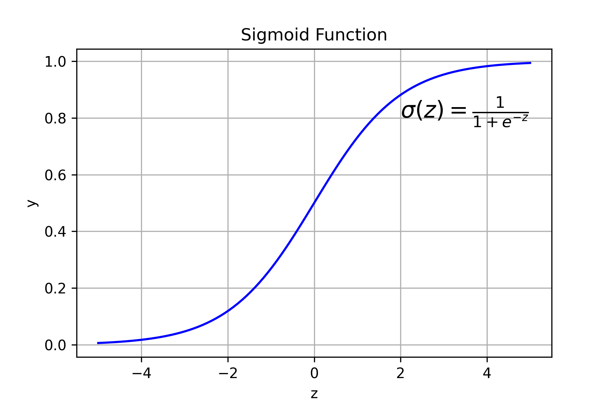
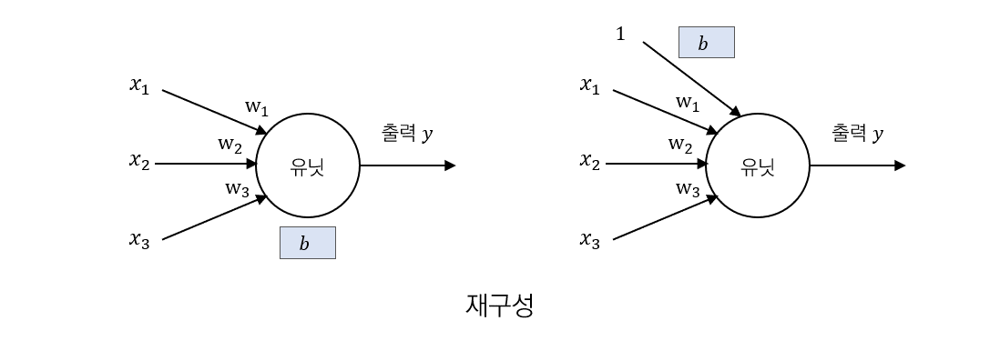
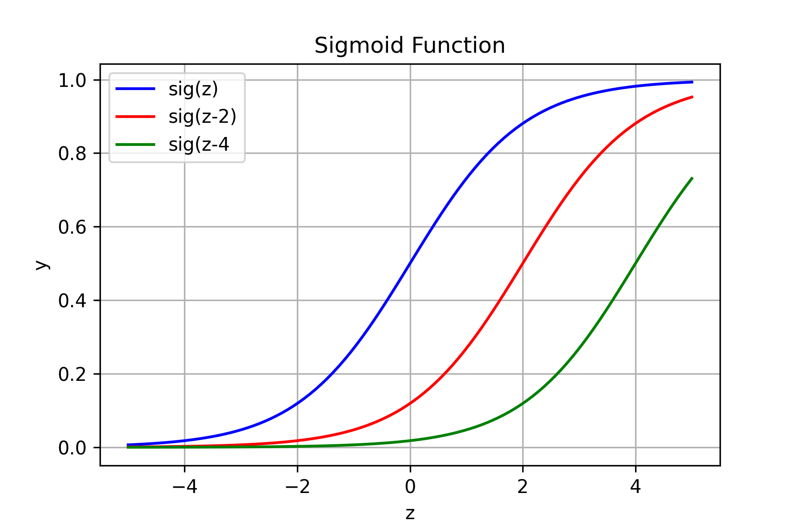

## 1. 신경망과 딥러닝

컴퓨터가 고양이를 인식할 수 있도록 하는 알고리즘을 만든다고 가정해보자. 고양이는 품종도 다양하고, 사진이 촬영된 구도에 따라 형태가 달라질 수 있기에 일관성을 찾지 못해 판독 조건을 정할 수 없을 것이다. 

 신경망 기반의 딥러닝은 이러한 문제를 쉽게 해결한다. 신경망은 네트워크의 관계속에서 주어진 데이터를 스스로 학습하고 이해하려한다. 

#### 신경망 (neural network, NN)

신경망은 생물학에서 뇌를 형성하는 뉴런 (신경세포)의 작용을 추상화하여 일정 단위의 인위적인 네트워크로 표현한것이다.

뇌를 형성하는 뉴런의 집합체를 수학 모델로 나타내는 것이 신경망의 출발점이다. 

#### 뉴런 

- 뉴런은 네트워크를 형성한다.
- 여러 뉴런에 전달되는 신호의 합이 임계값을 넘지 않으면, 뉴런은 반응하지 않는다.
- 여러 뉴런에 전달되는 신호의 합이 임계값을 넘으면 뉴런이 반응하며, 다른 뉴런에 ==일정 강도==의 신호를 전달한다.
- 뉴런에 전달되는 신호마다 가중치가 다르다.

## 2. 뉴런의 동작

다수의 뉴런은 사람의 뇌 속에서 네트워크를 이루는데, 이 네트워크의 신호 흐름에 따라 다양한 정보를 처리한다.

뉴런은 입력 신호를 받아들이는 수상돌기, 신호를 처리하는 신경세포체, 다른 뉴런으로 신호를 전달하는 축삭돌기로 이루어져 있다. 

뉴런이 입력으로 받은 신호들의 합이 작아 뉴런 고유의 임계값을 넘지 않으면, 뉴런의 신경세포체는 받은 신호를 무시하며, 

반대로 입력신호의 합이 임계값을 넘으면 신경 세포체는 축삭으로 연결된 다른 뉴런에 신호를 전달한다. 해당 뉴런은 출력 여부를 표현하게 된다. 이를 컴퓨터에서 표현하면 0 또는 1의 디지털 정보로 표현할 수 있다.

#### 뉴런의 반응 구조

뉴런의 반응 구조를 다음과 같이 정리할 수 있다.

- 다른 여러 뉴런들의 신호 합이 뉴런의 입력이다.
- 뉴런은 '신호 합'이 뉴런 고유의 임계값보다 클 때만 신호를 출력한다.
- 뉴런의 출력 신호는 반응했는지를 0과 1의 디지털 신호로 표현한다. 복수의 출력 신호가 있더라도 반응 여부만 0과 1로 나타낸다.

### 2.1. 뉴런의 반응 구조: 입력 신호

입력 신호는 다른 뉴런으로부터의 출력 신호이고 '있음'과 '없음'으로 나타낼 수 있다. 따라서 출력 신호를 변수 $x$라 할 때 다음과 같이 표현할 수 있다.

### 2.2. 뉴런의 반응 구조: 출력 신호

출력 신호도 입력 신호와 같이 '있음', '없음'으로 나타낼 수 있다. 따라서 출력 신호를 변수 $y$라 할 때 다음과 같이 표현할 수 있다.

### 2.3. 뉴런의 반응 구조: 반응 여부

뉴런은 '가중치를 고려한 신호의 합'을 입력 신호로 삼는다. 다른 뉴런으로부터의 입력 신호에 가중치를 각각 곱해 입력 신호로 삼는다. 이를 아래 그림과 같이 표현할 수 있다.

#### 반응 조건

뉴런은 신호의 합이 임계값보다 크면 반응하고 작으면 반응하지 않는다. 따라서 반응조건에 대한 식을 아래와 같이 세울 수 있다. ($\theta$는 뉴런 고유의 임계값이다.)

$$
\begin{cases}
출력\ 신호\ 없음\ (y=0):\  w_1 x_1 + w_2 x_2 + w_3 x_3 < \theta \\
출력\ 신호\ 있음\ (y=1):\ w_1 x_1 + w_2 x_2 + w_3 x_3 \geqq \theta
\end{cases}
$$

## 3. 반응 조건 그래프

#### 반응 조건 그래프

위에서 기술했던 반응 조건을 그래프로 시각화하면 아래와 같이 나타낼 수 있다.

#### 단위 계단함수

반응 조건 그래프를 일반화 하면 아래처럼 나타낼 수 있다.

 

$z = x_1w_1 + x_2w_2 + x_3w_3 - \theta$ 로 치환

단위 계단 함수를 이용하여 반응 조건에 관한 식을 하나로 표현하면 아래와 같다.

$$ 반응\ 조건에\ 관한\ 식:\ y = u(x_1w_1 + x_2w_2 + x_3w_3 - \theta)    $$

또한 해당 식에서 $z (x_1w_1 + x_2w_2 + x_3w_3 - \theta)$ 를 뉴런의 가중 입력이라고 한다.

## 4. 뉴런 단순화

뉴런을 단순화 하여 아래처럼 나타낼 수 있다. 단순화한 뉴런은 유닛 (unit)이라고 한다.

## 5. 활성화 함수

반응조건에 관한 식인 단위 계단 함수 $y = u(x_1w_1 + x_2w_2 + x_3w_3 - \theta)$ 는 특정값에 영향을 받지 않는 함수 $a$로 바꿔 일반화할 수 있다.
$$
y = a(w_1x_1 + w_2x_2 + w_3x_3 - \theta)
$$

정의한 함수 $a$를 활성화 함수 (activation function) 라고 한다. 

### 2.1. 시그모이드 ( Sigmoid) 함수 

활성화 함수의 대표적인 예로는 시그모이드 함수 $\sigma(z)$ (= 로지스틱, logistic) 가 있다.
$$
\sigma (z) = \frac{1}{1+e^{-z}} \qquad (e= 자연상수,\ natural\ number)
$$

아래 2개 특징이 시그모이드 함수를 사용하는 이유이다.

- 출력이 0과 1사이의 값이다. → exploding gradient 문제를 방지한다.
- 미분 가능한 함수이다.

## 6. 편향 (bias)

$y = a(w_1x_1 + w_2x_2 + w_3x_3 - \theta)$ 에서 $\theta$는 뉴런의 신호 출력 여부를 결정하는 임계값이다. 

$-\theta$를 $b$ 로 치환하여 $y = a(w_1x_1 + w_2x_2 + w_3x_3 + b)$ 로 나타낼 때 $b$를 bias라고 한다.

- 반응 조건에 관한 식: $y = a(w_1x_1 + w_2x_2 + w_3x_3 + b)$
- 가중 입력: $z = w_1x_1 + w_2x_2 + w_3x_3 + b$

  

#### 뉴런 재구성

가중입력  $z = w_1x_1 + w_2x_2 + w_3x_3 + b$는  $z = w_1x_1 + w_2x_2 + w_3x_3 + b\times1$로 재구성할 수 있다.

이는 항상 1이라는 입력이 존재한다고 해석이 가능하다.

#### Bias 의 역할

bias를 이용하면  activation 함수를 평행이동 시킬 수 있어 네트워크 전체를 움직일 수 있다. 

#### 벡터로 나타내기

가중 입력은  $(w_1, w_2, w_3, b)(x_1, x_2, x_3, 1)$ 와 같이 벡터의 내적으로 표현이 가능하다. 

-----
#### reference

- 처음 배우는 딥러닝 수학
- https://chanhyeonglee.tistory.com/5

