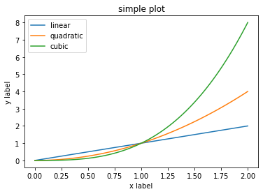
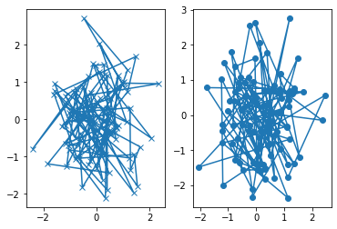

## 1. Figure 구성요소 (Parts of a Figure)


### Figure

`Figure`: 전체적인 그림을 가리킨다. `pyplot`을 이용하여 만들 수 있다.

```python
fig = plt.figure() # 축이 없는 빈 figure를 생성한다.
fig, ax = plt.subplots() # Axes 하나인 figure를 생성한다.
fig, axs = plt.subplots(2, 2) # 2x2 그리드인 figure를 생성한다.
```


### Axes

`Axes`: `plot`(도표) 이라고 생각하는 것이며, 데이터 공간을 가진 이미지 영역이다. `figure`는 다수의 `Axes`를 포함할 수 있지만, `Axes` 는 2차원 그래프의 경우 데이터 한계를 처리하는 2개의 `Axis` 오브젝트를 포함한다. 각각의 `Axes`는 `title` 과 `x-label`, `y-label`을 가진다.


#### methods

- `axes.Axes.set_xlim()`: x축 한계 설정
- `axes.Axes.set_ylim()`: y축 한계 설정 
- `set_title()`: 제목 설정
- `set_xlabel()`: x축 라벨 설정
- `set_ylabel()`: y축 라벨 설정 


### Axis

`Axis`: number-line-like 오브젝트이다. graph 제한이나 ticks (축 위의 마크: 눈금), `ticklabels` (눈금 표시 문자열 라벨)을 세팅할 수 있다. 
`ticks`의 위치는 `Locator` 오브젝트에 의해 결정되고 `ticklabels`은 `Formatter` 오브젝트로 포매팅된다. `Locator`과 `Formatter`를 적절히 자용하여 `ticks`와 `ticklabels`를 세밀하게 제어할 수 있다.

### Artist

`Artist`: 기본적으로 도표 (figure)에서 볼 수 있는 모든 것은 `Artist`이다 (`Figure, Axes, Axis`, ...). `Artist`는 `Text, Line2D, collections, Patch` 등의 오브젝트를 포함한다. figure가 렌더링되면 모든 `artist`는 `canvas`에 그려진다. 대부분의 `Artist`는 `Axes`에 연결되어 있으며 이러한 `Artist`는 여러 `Axes`에서 공유하거나 다른 `Axes`로 이동할 수 없다.

## 2. plotting 함수의 입력 타입 (Types of inputs to plotting functions)

plotting 함수는 입력으로 `numpy.array` 또는 `numpy.ma.masked_array`를 받는다. `pandas` 데이터 오브젝트나 (ex. `DataFrame`) `numpy.matrix`는 동작하지 않을 수도 있다. 함수를 사용하려면, `numpy.array` 로 변환하는 것을 가장 권장하고 있다.


```python 
import numpy as np   
import pandas as pd

# pandas.DataFrame to numpy.array
a = pd.DataFrame(np.random.rand(4, 5), columns=list('abcde'))
a_array = a.values

# numpy.matrix to numpy.array
b = np.matrix([[1, 2], [3, 4]])
b_array = np.asarray(b)
```

## 3. object-oriented 인터페이스와 pyplot 인터페이스

`matplotlib`는 동일한 성능을 내는 object-oriented (OO-style) 인터페이스와 pyplot 인터페이스 2개의 방법을 사용하여 figure를 그린다.


- `object-oriented`: 인터페이스를 사용하면 그림과 축을 명시적으로 만들고, 그 위에 메소드를 호출한다.
- `pyplot`: 그림과 축을 자동으로 생성하고 관리하며, `pyplot`함수를 사용하여 플로팅을 한다.


</br>

`pylab import *`를 사용하여 `pylab` 인터페이스를 사용하는 예제를 확인할 수도 있는데 이것은 MATLAB-like style이며 이전에 사용하던 사용 방법이다.

### 3.1. object-oriented 인터페이스 

-  그림과 축을 명시적으로 만들고, 그 위에 메소드를 호출한다.
- non-interactive style (대규모 프로젝트의 일부로 재사용될 수 있는 function 과 script)에 적합하다.

##### ex-1

```python
import matplotlib.pyplot as plt 
import numpy as np   

x = np.linspace(0, 2, 100)

fig, ax = plt.subplots()            # figure와 axes를 생성한다.
ax.plot(x, x, label='linear')       # 데이터를 axes에 그린다.
ax.plot(x, x**2, label='quadratic') # 다른 데이터를 axes에 그린다.
ax.plot(x, x**3, label='cubic')
ax.set_xlabel('x label')            # axes의 x축에 label을 추가한다. (add x-label)
ax.set_ylabel('y label')            # axes의 y축에 label을 추가한다. (add y-label)
ax.set_title('simple plot')         # axes에 title을 추가한다.
ax.legend()                         # legend를 추가한다.

plt.figure()                        # figure를 그린다.
```





##### ex-2

```python
def my_plotter(ax, data1, data2, param_dict):
  """
  A helper function to make a graph

  Parameters
  ----------
  ax : Axes
      The axes to draw to

  data1 : array
      The x data

  data2 : array
      The y data

  param_dict : dict
      Dictionary of kwargs to pass to ax.plot

  Returns
  -------
  out : list
      list of artists added
  """
  out = ax.plot(data1, data2, **param_dict)
  return out

data1, data2, data3, data4 = np.random.randn(4, 100)

fig, (ax1, ax2) = plt.subplots(1, 2)
my_plotter(ax1, data1, data2, {'marker': 'x'})
my_plotter(ax2, data3, data4, {'marker': 'o'})
```




### 3.2. pyplot function

- 그림과 축을 자동으로 생성하고 관리하며, pyplot함수를 사용하여 플로팅을 한다.
-  interactive plotting (ex, jupyter notebook) 에 더 적합하다.

```python
import matplotlib.pyplot as plt 
import numpy as np   

x = np.linspace(0, 2, 100)

plt.plot(x, x, label='linear')        # axes 위에 데이터를 표시한다.
plt.plot(x, x**2, label='quadratic')  # 위와 같음
plt.plot(x, x**3, label='cubic')      # ...
plt.xlabel('x label')                 # x 축에 라벨을 추가한다.
plt.ylabel('y label')                 # y 축에 라벨을 추가한다. 
plt.title("Simple Plot")              # 제목을 추가한다.
plt.legend()                          # legend 를 추가한다.

plt.figure()
```


-----

##### 영어 정리

- `fine`: 섬세한 (a);
- `implicit`: 암시된 (a); 절대적인 (a)
- this approach is trongly discouraged nowadays and deprecated; 
  - `discouraged`: 낙담한, 낙심한 (a);
  - `nowadays`: 요즘에는 (ad);
  - `deprecated`: [신조어] 중요도가 떨어져 더 이상 사용되지 않고 앞으로는 사라지게 될 (컴퓨터 시스템 기능 등) (a);

-----

##### reference

- https://matplotlib.org/3.3.3/tutorials/introductory/usage.html#sphx-glr-tutorials-introductory-usage-py