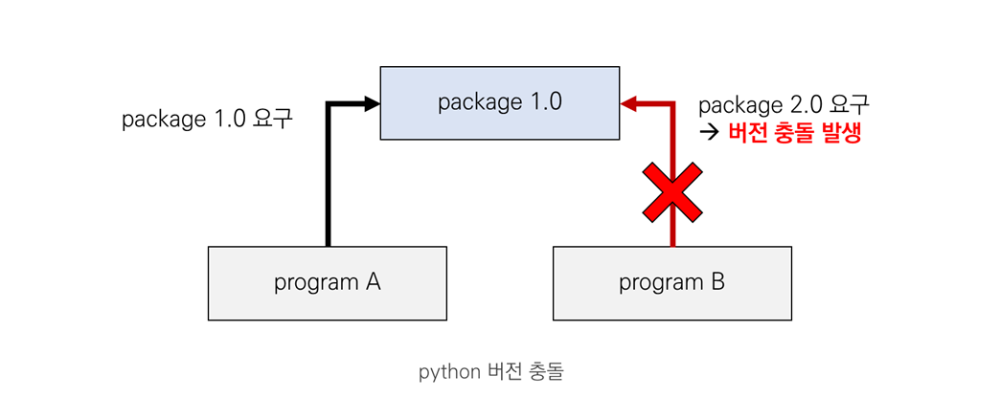

# 1. Virtual Environment (가상환경)

프로젝트를 진행하는데에는 여러 모듈 또는 패키지들이 요구되는데, 다수의 프로젝트가 같은 패키지를 공유한다면 패키지 호환성과 같은 충돌 문제가 발생할 수 있다.



예를 들어 위의 그림과 같이 프로그램 A, B가 모두 특정 package를 요구하지만, 요구하는 package의 버전이 다르다면 호환이 되지 않는 문제가 발생하게 된다. 

이러한 문제를 피하기 위해, 각 프로젝트마다 **독립적인 환경**을 구성하여 작업을 진행하는데, 이 독립적인 환경을 **가상환경(virtual environment)** 라고 한다.


# 2. Create Virtual Environment (가상환경 만들기)

python에서는 주로 `venv`, `virtualenv`, `conda`를 사용하여 가상환경을 생성하는데, 해당 글에서는 `conda`를 이용한 가상환경 생성에 대해서는 다루지 않았다.

> `conda`는 `anaconda` 라는 data science를 위한 python 패키지 배포판 환경에서의 명령어인데, `anaconda` 에 대해 글을 작성할 때, `conda` 를 사용한 가상환경 생성에 대해 기술하겠습니다.


## 2.1. venv를 사용하여 가상환경 만들기

`venv`는 python 버전 3.3 부터 내장된 가상환경 구성 모듈이며, [버전 3.5 부터 가상환경을 만드는데 권장 되고 있다.](https://docs.python.org/ko/3/library/venv.html#module-venv)  

`venv`는  `virtualenv`과 비교했을 때, 설치가 필요없기 때문에 상대적으로 간단한 편이다.

#### 1) 가상환경 생성

아래 명령어는 `.venv` 라는 이름의 가상환경을 생성하는 명령어이다. [가상환경](https://docs.python.org/ko/3/tutorial/venv.html) 이름은 `.venv`로 설정하는 것이 일반적이라고 하는데,  셸에 출력되지 않음과 동시에 이름으로부터 그 의미를 파악할 수 있기 때문이다. 

아래 명령어를 실행하면 `.venv` 라는 이름의 디렉토리가  생성되는 것을 확인할 수 있다.

```bash
# create virtual environment
# virtual environment name: .venv
$ python -m venv .venv
```

#### 2) 가상환경 활성화

생성된 가상환경 디렉토리 내에 있는  `bin/activate` 를 실행하면 가상환경을 활성화 할 수 있다. 가상환경이 활성화되면 셸 프롬프트 앞에 가상환경이 표시된다. 

```bash
# activate virtual environment
$ source .venv/bin/activate
(.venv) $ 
```

#### 3) 가상환경 비활성화

가상환경을 비활성화 하고 싶다면 `deactivate` 명령어를 실행하면 된다. 

```bash
# deactivate virtual environment
(.venv) $ deactivate
$
```

<br/>

## 2.2. virtualenv 를 사용하여 가상환경 만들기

`venv` 가 `virtualenv` 보다 간단하긴 하지만, `virtualenv`는 `venv` 보다 많은 기능을 제공한다. ( `virtualenv`의 일부 기능이 `venv` 에 통합된 것이며, `vnev` 는 `virtualenv`의 모든 기능을 제공하지 못한다고 한다.)

자세한 설명은 [virtualenv 문서](https://virtualenv.pypa.io/en/stable/)에서 확인할 수 있다. 

> 참고로 문서에 작성된 "is slower (by not having the app-data seed method)," 는 실행에 관련된게 아니라 설치에 관련된 말이다. 
> → 패키지 설치 속도를 비교했을 때 `virtualenv` 가 `venv` 보다 빠르다.
>
> ref: [https://stackoverflow.com/questions/65237115/what-does-virtualenv-faster-than-venv-mean-just-when-creation-or-when-running](https://stackoverflow.com/questions/65237115/what-does-virtualenv-faster-than-venv-mean-just-when-creation-or-when-running)

#### 1)  virtualenv 설치 

먼저 `pip` 명령어로 `virtualenv`을 설치한다.

```bash
# install virtualenv
$ pip install virtualenv 
```

#### 2) 가상환경 생성

이전에 했던 것과 마찬가지로, `.venv` 라는 이름의 가상환경을 생성한다. 아래 명령어를 실행하면 `.venv` 라는 이름의 디렉토리가  생성되는 것을 확인할 수 있다.

```bash
# create virtual environment
$ virtualenv .venv
```

#### 3) 가상환경 활성화

마찬가지로 생성된 가상환경 디렉토리 내에 있는  `bin/activate` 를 실행하면 가상환경을 활성화 할 수 있다. 가상환경이 활성화되면 셸 프롬프트 앞에 가상환경이 표시된다. 

```bash
# activate (mac or linux)
$ source .venv/bin/activate  
(.venv) $

# activate (windows)
$ .venv/Scripts/activate  
(.venv) >
```

#### 4) 가상환경 비활성화

`deactivate` 명령어 실행으로 가상환경을 비활성화할 수 있다.

```bash
# deactivate virtual environment
(.venv) $ deactivate
```

<br/>

# 3. 패키지 관리

`pip freeze`  명령어는 설치된 패키지 이름과 버전을  출력해주는 명령어이다. 가상환경 활성화 상태에서 이 명령어를 치면 해당 **가상환경에 설치된 패키지 정보**를 얻을 수 있다. 

만약 이를 파일로 정리하고 싶다면 아래와 같이 명령어를 입력하면 된다. 패키지 정보가 정리된 파일은 다른 가상환경의 패키지를 **일괄 삭제**하거나 **일괄 설치**하는 데에 활용될 수 있다. 

```bash
(.venv) $ pip freeze > temp.txt
```

생성한 패키지 목록을 사용하여 일괄 설치/삭제를 하는 명령어는 다음과 같다.


#### 일괄 설치 명령어

```bash
(another_venv) $ pip install -r temp.txt
```


#### 일괄 삭제 명령어

```bash
(another_venv) $ pip uninstall -r temp.txt -y
```