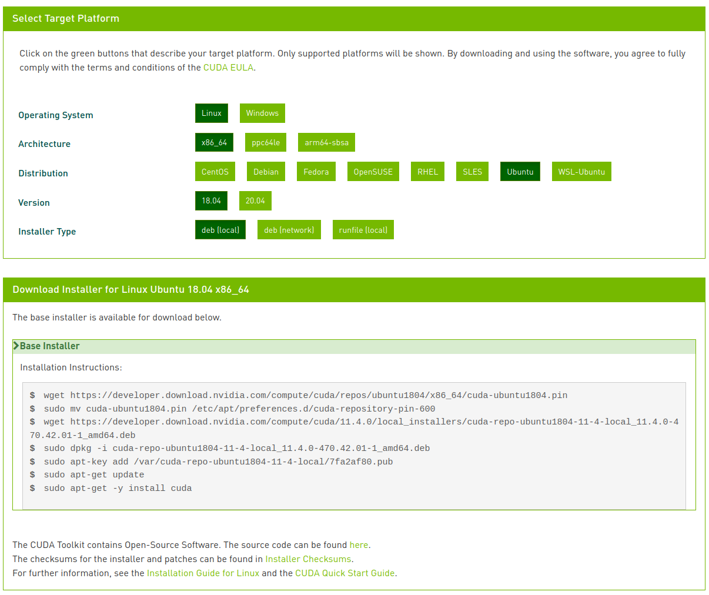

사전 작업

- 컴파일 전 필요한 패키지들을 설치한다
    
    ```bash
    sudo apt-get install build-essential
    ```
    

# 1. NVIDIA 드라이버 설치

## 특정 버전 설치 (apt)

### 그래픽 카드 정보 확인

```bash
# 그래픽 카드 정보 확인 명령어
ubuntu-drivers devices

# output
== /sys/devices/...
modalias : ...
vendor   : NVIDIA Corporation
driver   : nvidia-driver-450-server - distro non-free
driver   : nvidia-driver-460 - distro non-free recommended
driver   : nvidia-driver-470 - third-party non-free
driver   : nvidia-driver-418-server - distro non-free
driver   : nvidia-driver-460-server - distro non-free
driver   : nvidia-driver-470-server - distro non-free
```

명령어를 입력하고 출력을 보면 `nvidia-driver-460` 을 추천하고 있다

```bash
driver   : nvidia-driver-460 - distro non-free recommended
```

### 설치

```bash
# Add repository
sudo add-apt-repository ppa:graphics-drivers/ppa
sudo apt update

# Install driver (460)
sudo apt-get install nvidia-driver-460
```

## 권장 드라이버 설치 (apt)

```bash
# Add repository
sudo add-apt-repository ppa:graphics-drivers
sudo apt-get update

# Install driver 
sudo ubuntu-drivers autoinstall.

# REBOOT
sudo reboot
```

## 설치 확인

명령어를 입력하여 NVIDIA 드라이버가 잘 설치되었는지 확인한다. 

```bash
# command
nvidia-smi

# output
+-----------------------------------------------------------------------------+
| NVIDIA-SMI 470.42.01    Driver Version: 470.42.01    CUDA Version: 11.4     |
|-------------------------------+----------------------+----------------------+
...

```

# 2. CUDA 설치

## 설치

`nvidia-smi` 명령어를 입력하면 사용하는 드라이버의 추천 CUDA version 이 나온다.

```bash
# command
nvidia-smi

# output
+-----------------------------------------------------------------------------+
| NVIDIA-SMI 470.42.01    Driver Version: 470.42.01    **CUDA Version: 11.4**     |
|-------------------------------+----------------------+----------------------+
...
```

[CUDA Toolkit Archive](https://developer.nvidia.com/cuda-toolkit-archive) 에서 해당 버전을 선택하고 자신의 조건에 맞게 다운로드 한다.

조건을 선택하면, 아래 설치 명령어가 뜨는데, 이에 따라 명령어를 실행해주면 된다. 



## PATH 설정

설치를 완료했으면 PATH를 설정 해 준다.

`**~/.profile` 편집모드**

```bash
# ubuntu의 메모장? 같은 편집기
sudo gedit ~/.profile

# vim 편집기
sudo vim ~/.profile
```

**아랫 줄에 해당 입력 (사용자의 cuda 버전에 맞게 내용 수정 필요)**   

```bash
export PATH=/usr/local/cuda-11.4/bin:$PATH
export LD_LIBRARY_PATH=/usr/local/cuda-11.4/lib64:$LD_LIBRARY_PATH
```

**수정된 PATH 적용**

```bash
source ~/.profile
```

## 확인

설치를 완료했으면 명령어로 설치된 CUDA 버전을 확인한다.

```bash
# command
nvcc -V

# output 
nvcc: NVIDIA (R) Cuda compiler driver
Cuda compilation tools, release 11.4, V11.4.48
```

# 3. cuDNN (Deep Neural Network) 설치

[nvidia-cudnn-archive](https://developer.nvidia.com/rdp/cudnn-archive) 에서 CUDA 버전에 맞는 cuDNN을 다운로드 한다 (로그인이 필요한 서비스이다). 

버전을 선택하면 여러 파일 링크가 뜨는데, os가 ubuntu이므로 **cuDNN Library for Linux**를 선택한다.  

**다운로드 후에 아래 명령어를 실행하여 설치를 진행한다.** 

```bash
# 다운로드 폴더 이동
cd ~/Downloads

# 압축 풀기 
tar -zxvf cudnn-XX-linux.tgz

# 파일 복사
sudo cp ./cuda/include/* /usr/local/cuda-11.4/include
sudo cp -P ./cuda/lib64/* /usr/local/cuda-11.4/lib64

sudo chmod a+r /usr/local/cuda-11.4/lib64/libcudnn*
```

**cuDNN 설치 확인**

```bash
# ~ cuDNN 7.X
cat /usr/local/cuda/include/cudnn.h | grep CUDNN_MAJOR -A 2

# cuDNN 8.x ~
cat /usr/local/cuda-11.4/include/cudnn_version.h | grep CUDNN_MAJOR -A 2
```

**cuDNN 설치 확인 시, 아래와 같이 8.2.2 버전이 설치된 것을 확인할 수 있다.** 

```bash
#define CUDNN_MAJOR 8
#define CUDNN_MINOR 2
#define CUDNN_PATCHLEVEL 2
```
