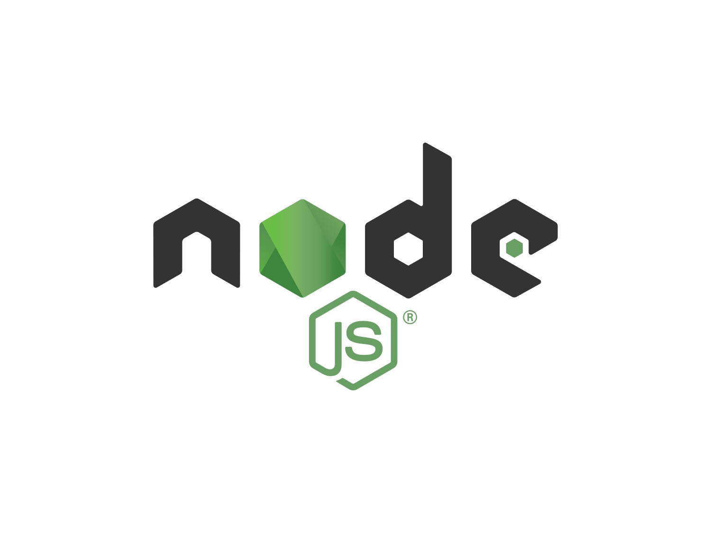
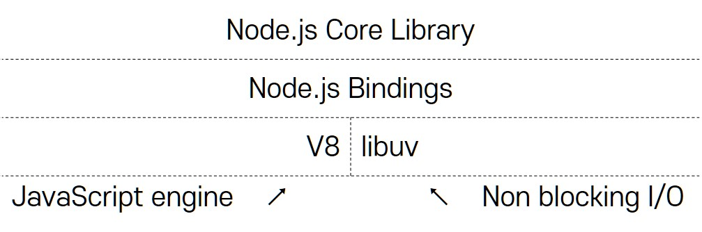
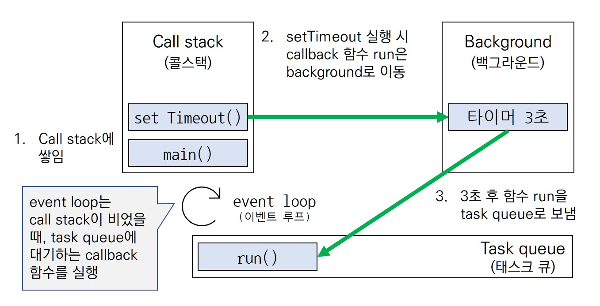
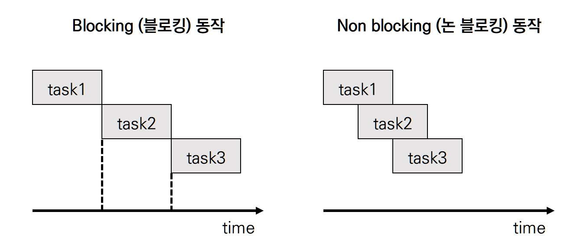

# 1. Node.js



### Node.js
- `Node.js`: open-source, cross-platform `자바스크립트 런타임` 환경
  - runtime (런타임)이란 특정 언어로 만든 프로그램들을 실행할 수 있는 환경을 말한다. 웹 브라우저 또한 자바스크립트 런타임의 하나이다. 
  - Node.js는 크롬 V8 자바스크립트 엔진으로 빌드된 자바스크립트 런타임 환경으로 자바스크립트 프로그램을 브라우저 밖에서도 실행되게 한다.
  - 이전에도 브라우저 외의 환경에서 자바스크립트를 실행하려는 시도는 있었으나, 속도가 느리다는 문제 때문에 좋은 반응을 보이지 못했다. 
  - 구글 크롬 V8 엔진은 타 자바스크립트 엔진보다 속도가 빠르기 때문에 위의 문제점을 해결하였다.

- Node.js 는 `Single thread` 애플리케이션이며, `event-driven`, `non-blocking` 모델을 통해 concurrency (동시성) 을 지원한다. 
  event-driven, non-blocking I/O 모델을 사용하기 때문에 가볍고 효율적이다. 
  

#### Node.js Dependencies

  

  이 외에도 다수의 의존성이 존재한다.


# 2. Node.js 특징


## 2.1. Event-driven (이벤트 드리븐, 이벤트 기반)

### event-driven (이벤트 드리븐, 이벤트 기반)

- event-driven이란 이벤트가 발생할 때 미리 지정한 작업을 수행하는 방식을 뜻한다. "특정 이벤트가 발생"했을 때 "무엇을 실행할 지" 등록해야 하는데, 이를 `event listener (event handler)` 에 `callback` 함수를 등록한다고 표현한다.
- 이벤트가 발생하면 Node.js 는 `event listener`에 등록한 `calllback`을 실행하는데,  더 이상 수행할 `callback`이 없다면 Node.js는 대기하게 된다.

<br>

**example**<br>
아래 "hello world" 예제는 많은 연결을 동시에 다룰 수 있다.
각각의 연결에 대해 Node.js 는 callback 을 실행하는데,  더 이상 수행할  callback 이 없다면 Node.js는 대기하게 된다.

  ```jsx
  const http = require('http');

  const hostname = '127.0.0.1';
  const port = 3000;

  const server = http.createServer((req, res) => {
    res.statusCode = 200;
    res.setHeader('Content-Type', 'text/plain');
    res.end('Hello World');
  });

  server.listen(port, hostname, () => {
    console.log(`Server running at http://${hostname}:${port}/`);
  });
  ```


### event loop (이벤트 루프)
Node.js 는 runtime 생성자로 라이브러리대신 `event loop` 를 사용한다.

- **event loop** (이벤트 루프)<br>
  `event loop` 는 이벤트 발생 시 호출할 `callback` 함수들을 관리하고, 호출된 `callback` 함수의 실행 순서를 결정한다. 노드가 종료될 때까지 이벤트 처리를 위한 작업을 반복한다.

- **task queue** (태스크 큐, = callback queue, 콜백 큐)<br>
  이벤트 발생 후 호출되어야 할 `callback` 함수들이 기다리는 공간

- **background** (백그라운드)<br>
  타이머나 I/O 작업 콜백 또는 `event listener` 가 대기하는 곳

- **example**
  
    ```jsx
    function run(){
        console.log(`timeout completed`);
    }
    setTimeout(run, 3000);
    ```

	

    - `call stack` 에서 main 까지 실행이 완료되어 `call stack` 이 완전히 비워진다면 `event loop`는 `task queue`에서 함수를 가져와 `call stack`에 넣고 실행한다.
    - `event loop`는 `task queue`에 `callback` 함수가 들어올 때까지 계속 대기하게 된다.
    - `event loop`는 `call stack` 이 비어 있을 때만 `task queue`의 함수를 `call stack`으로 가져오기 때문에 만약 `call stack` 에 함수들이 너무 많다면 `setTimeout`이 정확하게 동작하지 않을 수도 있다.


## 2.2. Non-blocking (논 블로킹)

이벤트 루프에서 실행 시간이 긴 함수를 백그라운드로 보내서 다음 코드가 먼저 실행되도록 하면 오래걸리는 작업을 효율적으로 처리할 수 있다. 이러한 방식을 none-blocking (논 블로킹)이라 한다.

non blocking이란 이전 작업이 완료될 때까지 멈추지 않고 다음 작업을 수행함을 뜻한다.



- Node.js와 non-blocking
  - 그림에서 보이듯이 **non blocking 방식은 blocking 방식에 비해 짧은 시간에 많은 태스크를 처리할 수 있다**. node.js는 single thread 이기 때문에 동시에 두가지 작업을 처리하는 것이 불가능하므로 non blocking 동작이 유리하다.
  - node.js는 **높은 연산을 요구하는 작업** (함수가 계속해서 call stack에 존재)에는 **비효율적**이지만, 다른 컴퓨팅 자원을 이용하는 **I/O 작업** (call stack을 주기적으로 비움)에서 **시간적 이득**을 볼 수 있다. I/O 작업의 예로는 파일 시스템 접근, 네트워크 요청 등을 들 수 있다.


## 2.3. Single thread (싱글 스레드)

### Thread-based (스레드 기반) 방식과의 비교

- **Node.js 장점** 
  - 스레드 기반 네트워킹은 상대적으로 비효율적이고 다루기가 어렵다.
  - Node.js 는 `lock` 이 없기 때문에 `deadlock`을 고려하지 않아도 된다.
  - Node.js 는 확장성 있는 프로그램을 개발하는데 적합하다.
      - Node.js 에서 I/O 를 직접 수행하는 함수는 거의 없으므로 프로세스가 `block`되지 않기 때문에 확장성있는 프로그램을 개발하는데 적합하다.

<br>

- **Node.js multi process**
  - Node.js 가 단일 스레드라 해서 멀티코어를 활용하지 못하는 것은 아니다.
      Node.js 는 스레드를 늘리는 대신 멀티 프로세싱 방식을 택했다. [`child_process.fork()`](https://nodejs.org/api/child_process.html#child_process_child_process_fork_modulepath_args_options) API 를 사용하면 `child process`들을 생성할 수 있다.
  - 같은 인터페이스에 구성된 [`cluster`](https://nodejs.org/api/cluster.html) 모듈을 사용하면 코어에 `*load balancing(부하 분산)`이 가능하도록 프로세스들 간에 소켓을 공유할 수 있다.

- **Load Balancing (부하 분산)*
  - 여러 서버에 네트워크 트래픽을 분산시키는 프로세스로 하나의 서버가 너무 많은 요청을 받게되는 것을 막는다. 
  작업을 균등하게 분산함으로써 애플리케이션 응답성을 향상시킨다.


# 겸사겸사 영어공부

#### 단어

|영어   | 한글      |
| ------| --------- |
| concurrently | (…와) 동시에, 함께, 겸임하여 ((with)) |
| further      | 더 나아가다                           |


#### 기술 용어

| 영어   | 한글         |
| -------| ------------ |
| scalable network      | To "scale a network" means to "grow a network" or "increase the size of a network" <br>scalability means the ability to be able to scale or adapt the network for future growth. On another note, limited scalability means that there are limitations placed on how large a network can be grown or increased. |
| callback/event firing | callback/event firing, callback is fired                     |

