# 1. Computer System

- computer system
  - 데이터를 처리하기 위해 다양한 작업을 수행하는 장치
  - Computer system 은 Hardware와 Software로 이루어져 있다.

- Two main components
  - Hardware (H/W)
    - command 또는 instruction를 처리할 수 있는 물리적이고 실제하는 디바이스
  - Software (S/W)
    - 데이터를 다루기 위한 instruction collection
    - OS (Operating System) 또한 컴퓨터 시스템의 main software 중 하나이다.

# 2. Hardware

하드웨어에는 세 종류의 주요 component가 있는데, 각각의 component들은 **system bus**를 통해 서로 연결되어 있다.

| 종류                               | 설명                                                                    |
|----------------------------------|-----------------------------------------------------------------------|
| **processor** (프로세서)          | 기본연산을 수행하여 instruction를 수행한다. CPU (Central Processing Unit) 으로 참조됨 |
| **Memory** (메모리)              | 정보를 저장한다.                                                             |
| **Peripherals** (I/O Devices) | 컴퓨터에 정보를 입력하고 출력한다.                                                   |

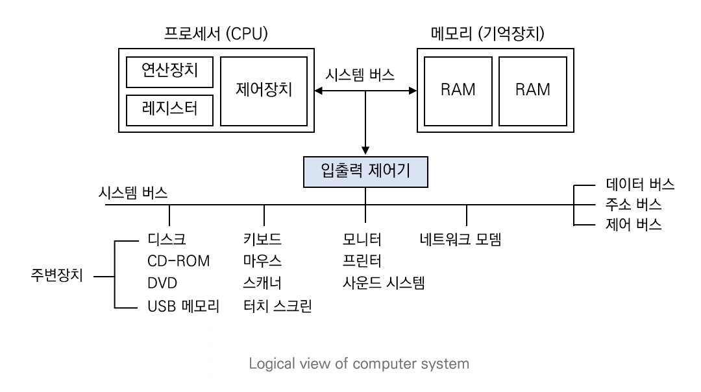

## 2.1.  HW: Processor (프로세서)

**REGISTER** (레지스터)와 **ALU** (연산 장치) 로 instruction를 실행

- Register: save/load data for ALU
- ALU (Arithmetic Logical Unit): 레지스터의 데이터로 instruction 수행

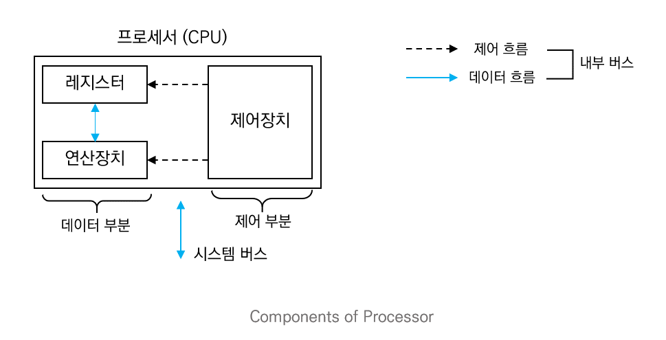

### 2.1.1. MultiProcessor system

- A system that has a multiple processor
  - quad-core: 4 processors/ octa-core: 8 processors

- Why?
  - more processors -> **higher concurrency (동시성)** : multiple instructions can be executed simultaneously (다중의 instruction이 동시에 실행될 수 있다)

### 2.1.2. Register (레지스터)

Register 는 processor 내부에 있는 ***memory*** 이다.  시스템의 모든 메모리 디바이스 중에서 가장 빠르다.

- Register Size
  - register 의 크기는 processor가 한 번에 처리할 수 있는 데이터의 크기를 결정한다.
  - n-bit processor computer는 최대 $2^n$ 메모리를 사용할 수 있다.

#### Types of registers: 사용자 가시 레지스터
- 데이터 레지스터 (DR, Data Register)
  - 함수  연산에 필요한 데이터를 저장한다. 값 문자 등을 저장하므로 산술 연산이나 논리 연산에 사용하며, 연산 결과로 플래그 값을 저장한다.  

- 주소 레지스터 (AR, Address Register)
  - 주소나 유효 주소를 계산하는 데 필요한 주소의 일부분을 저장한다. AR 에 저장한 값 (값 데이터)을 사용하여 산술 연산을 할 수 있다.
  
 

| 종류              | 설명                                                                                                                                                                      |
|-----------------|-------------------------------------------------------------------------------------------------------------------------------------------------------------------------|
| 기준 주소 레지스터   | 프로그램을  실행할 때 사용하는 기준 주소 값을 저장한다. 기준  주소는 하나의 프로그램이나 일부처럼 서로 관련 있는 정보를 저장하며, 연속된 저장 공간을 지정하는  데 참조할 수 있는 주소이다.  따라서 기준 주소 레지스터는 페이지나 세그먼트처럼 블록화된 정보에  접근하는 데 사용한다. |
| 스택 포인터  레지스터 | 메모리에 프로세서 스택을 구현하는 데 사용한다. 많은 프로세서와 주소 레지스터를 데이터 스택 포인터와 큐 포인터로 사용한다.  보통 반환 주소, 프로세서 상태 정보, 서브루틴의 임시 변수를 저장한다.                                                   |

#### Control and Status Register: 사용자 불가시 레지스터

| 종류                                            | 설명                                                                                                                    |
|-----------------------------------------------|-----------------------------------------------------------------------------------------------------------------------|
| **프로그램 카운터  (PC, program Counter)**        | 다음에 실행할 명령어의 주소를 보관하는 레지스터이다.  계수기로 되어 있어 실행할 명령어를 메모리에서 읽으면 명령어의 길이만큼 증가하여 다음 명령어를 가리키며, 분기 명령어는 목적 주소로 갱신할 수 있다. |
| **명령어  레지스터   (IR, Instruction Register)** | 현재 실행하는 명령어를 보관하는 레지스터이다                                                                                              |
| 누산기  (ACC, Accumulator)                    | 데이터를 일시적으로 저장하는 레지스터이다                                                                                                |
| 메모리 주소 레지스터 (MAR, Memory Address Register) | 프로세서가 참조하려는 데이터의 주소를 명시하여 메모리에 접근하는 버퍼 레지스터이다                                                                         |
| 메모리 버퍼 레지스터  (MBR, Memory Buffer Register) | 프로세서가 메모리에서 읽거나 메모리에 저장할 데이터 자체를 보관하는 버퍼 레지스터이다. 메모리 데이터 레지스터 (MDR, Memory Data Register)라고도 한다.                      |

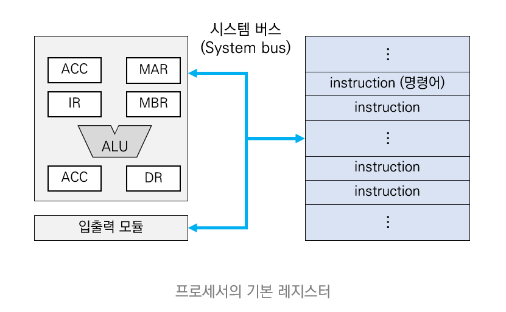

## 2.2.  HW: Memory (메모리)

bit pattern (0 or 1) 으로 정보를 저장한다. 
목적에 따라 다양한 종류가 존재한다.

- Hierarchical memory structure (메모리 계층 구조)
  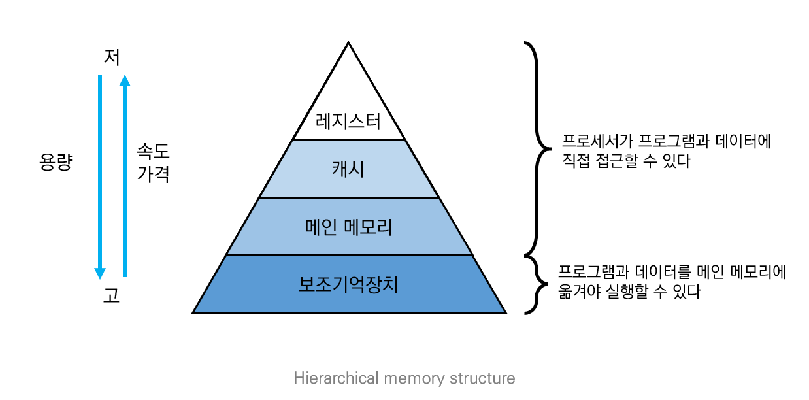

#### 1) Main Memory (메인 메모리)
- 긴 바이트 리스트 (8 bits 그룹)
    - 각각은 고유한 주소를 가진다
      → how many bits are required for using 4GB memory space?
- Interaction with the processor
     - Load: 데이터가 processor - register으로 복사됨
     - Save: 데이터가 processor - register 에서 memory 로 복사됨 

#### 2) Cache (캐시)
   - Problem
     - processor의 처리 속도가 main memory 의 처리속도보다 훨신 빠르다.
     - main memory 의 data에 접근하는 평균 비용을 줄일 필요성을 느끼게 되었다.
   - Idea
     - main memory 와 processor 사이에 cache 라는 또 다른 메모리를 두었다. 

   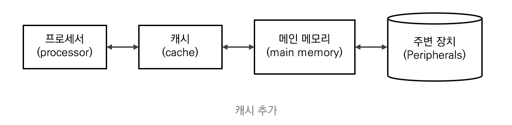

    

   - Term
     - **Cache Hit:** cache가 processor 가 요청한 데이터를 가지고 있다.
     - **Cache Miss:** cache가 processor 가 요청한 데이터를 가지고 있지 않다. processor는 main memory에서 데이터를 가지고 와야 한다.
     - **Cache Hit Ratio:** cache 조회 수에 대한 cache hit 비율 

     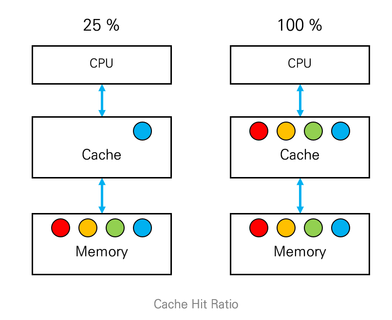

#### Auxiliary memory (보조기억장치)
  - 주변기기 사이의 데이터와 프로그램을 저장하는 하드웨어
  - = Secondary storagy, external storagy
  - HDD, SSD, etc

## 2.3. HW: System bus (시스템 버스)

System Bus: bus master 와 bus slave 사이에 데이터를 전달 

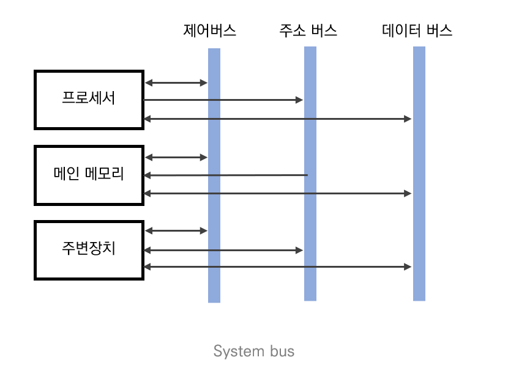

| 종류      | 설명                                                                                                        |
|---------|-----------------------------------------------------------------------------------------------------------|
| 데이터  버스 | 프로세서와  메인 메모리, 주변장치 사이에서 데이터를 전송한다.  데이터  버스를   구성하는  배선 수는 프로세서가 한 번에 전송할 수 있는 비트 수를 결정하는데 이를 워드라고 한다 |
| 주소  버스  | 프로세서가 시스템의 구성 요소를 식별하는 주소 정보를 전송한다.  주소 버스를 구성하는 배선 수는 프로세서와 접속할 수 있는 메인 메모리의 최대 용량을 결정한다.            |
| 제어  버스  | 프로세서가 시스템의 구성 요소를 제어하는 데 사용한다.  제어 신호로 연산장치의 연산 종류와 메인 메모리의 읽기나 쓰기 동작을 결정한다.                          |

### Bus master

- bus request signal 을 전송함으로써 bus transaction 을 시작
- CPU: main memory와 CPU-register 간에 데이터를 이동
- DMA (Direct Memory Access) controller
  - CPU의 도움 없이 main memory와 I/O buffer 간에 데이터를 이동

### Bus slave

- bus master 으로부터 command를 받고 그에 따라 동작한다.
- Memory controller (memory)
- Device controller (I/O device)
  - 특정한 디바이스 유형 담당
  - Has local registers and/or local buffer
  - CPU에 interrupt를 발생시켜 작업이 끝났음을 알린다.
    - *Note that: I/O device와 CPU는 동시에 실행될 수 있다. 

## 2.4. HW: Peripherals (I/O Devices)

- Input device: input data from outside (ex, mouse, keyboard, microphone …)
- Output device: send data to the outside (ex, monitor, speaker, printer …)
- I/O Device Controller
  -  Each I/O device has its own controller

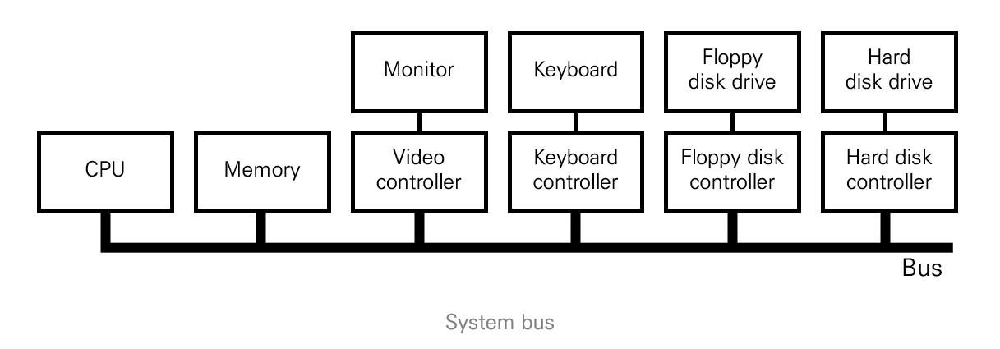

### I/O device controller

- 자체적인 register를 지닌다.
- I/O 작업 (operation)은 CPU에 의해 시작된다. (initiated by CPU)
  - Output operation
  - status register에서 output register 가 사용 가능한지 확인
      - 사용 가능하다면, 데이터를 output register로 이동시킨다. (output command를 control register로 이동시킨다)
      - 사용 불가능하다면, output register 가 사용 가능할 때까지 대기
      - **Polling I/O vs. Interrupt-driven I/O**

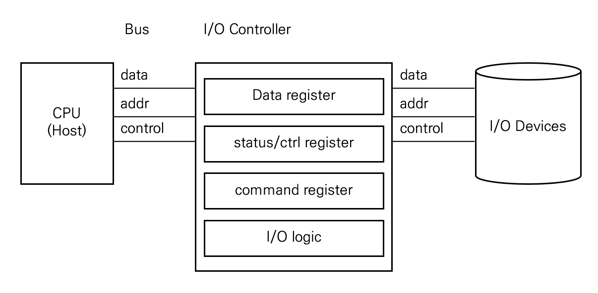

# 3. Interrupt 

- Interrupt
  - 즉각적인 주의를 필요로하는 이벤트를 나타내는 프로세스에 대한 신호 
  - H/W 또는 S/W 에 의해 발생한다.
  - interrupt가 발생하면 **ISR (Interrupt Service Routine)** 이 호출된다.
- Types of interrupts
  - H/W interrupt : Caused by H/W signal
  - S/W interrupt (a.k.a. Trap) : Caused either by an error or instruction

## 3.1. Interrupt H/W

- Interrupt destination
  - processor는 **Interrupt Request (IRQ)** 라는 input pin를 가진다. 
  - IRQ 는 processor에게 시스템의 다른 칩이 주의가 필요함을 알린다. 

- Interrupt source
  - I/O chip에는 서비스가 필요할 때,  assertion을 발생시키는 핀이 있다. 
  

- Legacy mechanism
  - not scalable

  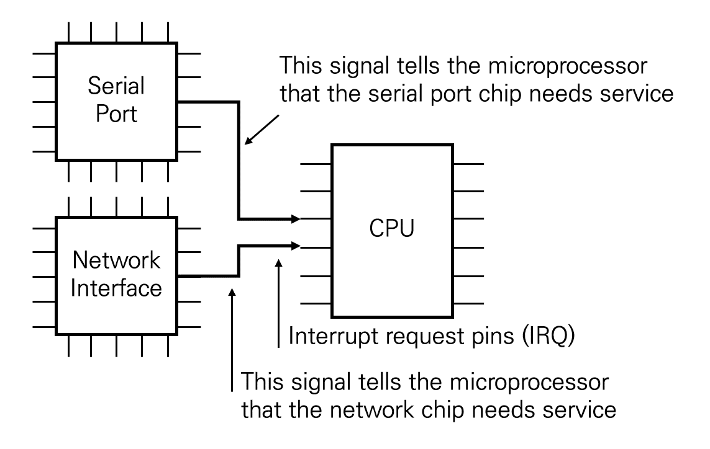

 

-  **PIC (programmable interrupt controller)**
    - Functions as an overall manager in an interrupt-driven system environment
    - IRQ 핀의 개수보다 많은 I/O 디바이스들을 지원할 수 있다.
  
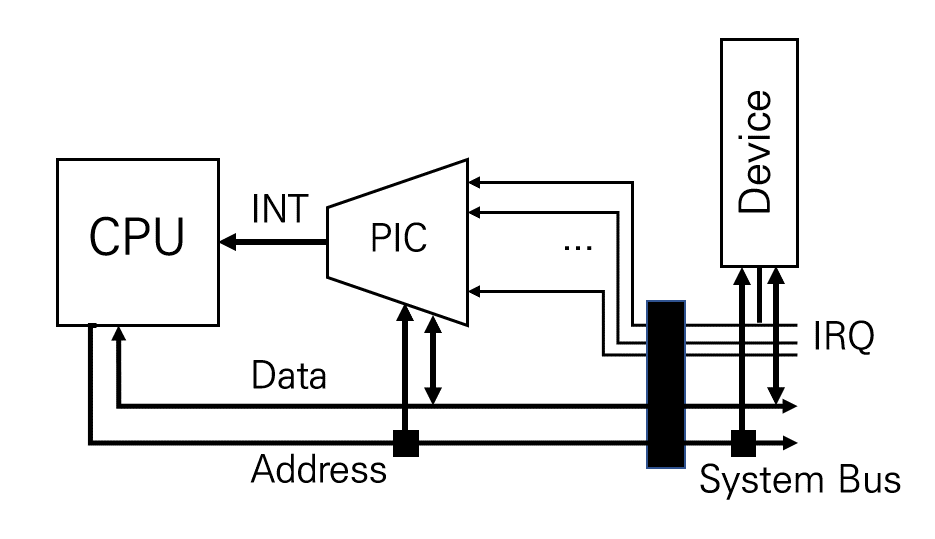

## 3.2.  Interrupt Mechanism

1. At the time of interrupt (interrupt 발생)
   - 현재 프로그램의 실행을 중지 

2. While interrupt is being processed (interrupt 처리 중)
   - interrupt 손실을 방지하기 위해 이후의 interrupt 수신을 비활성화한다.  

3. After the execution of ISR (ISR 실행 완료)
   - 저장된 주소를 통해 중단되었던 프로그램으로 복귀
