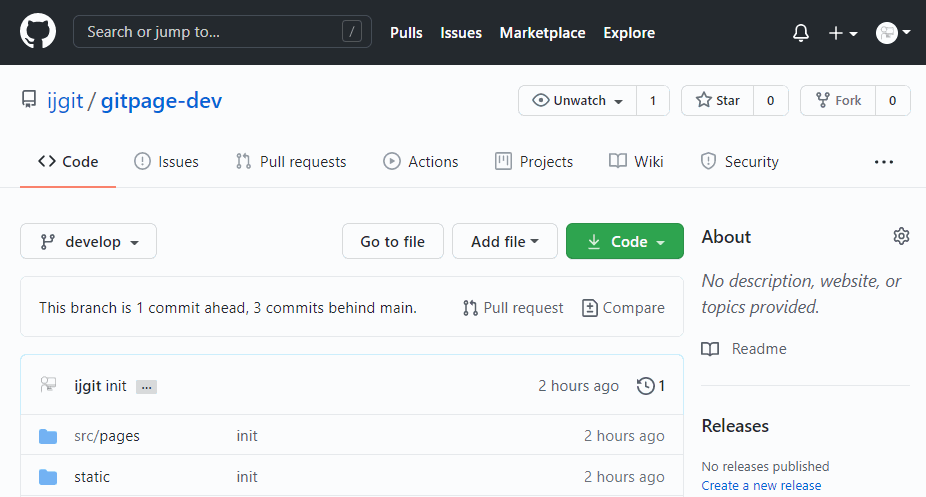
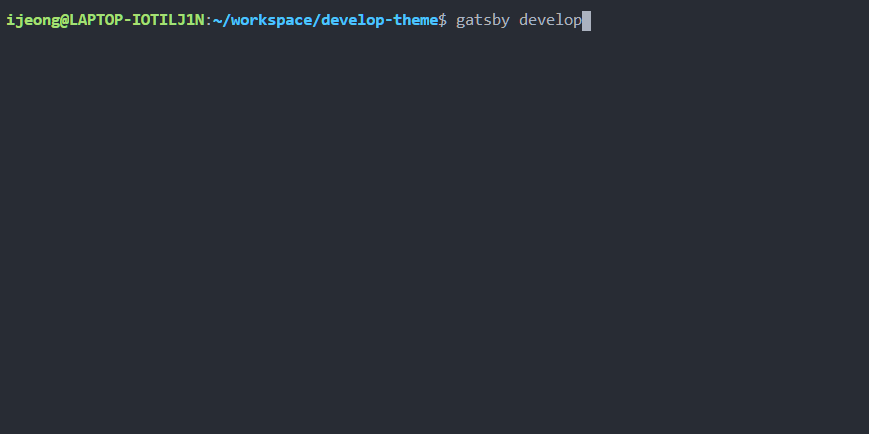

# GitPage 생성

GitPage (Github Page) 는 저장소에서 구성된 웹 사이트를 호스팅 할 수 있도록 GitHub 에서 제공하는 서비스이다. 

GitPage 는 ```USERNAME.github.io ```으로 호스팅하거나 저장소 (repository) 별로 페이지를 만들어 호스팅 하는 것이 가능하다. 이러한 페이지는 ```USERNAME.github.io/PROJECT_NAME``` 으로 접속할 수 있다. 

일반적으로 저장소 이름을 ```USERNAME.github.io``` 으로 설정하여 생성했을 시에 별다른 조작 없이 자동으로 GitPage 가 호스팅된다. 

저장소 이름에 따른 GitPage URL 은 아래와 같다

| repository name          | url                                           |
| ------------------------ | --------------------------------------------- |
| ```USERNAME.github.io``` | ```https://USERNAME.github.io```              |
| ```PROJECT_NAME```       | ```https://USERNAME.github.io/PROJECT_NAME``` |

<br>

### GitPage 페이지 소스 분기 구성

GitPage 가 동작하려면 GitHub Repository Setting 페이지에서 배포 분기를 설정해야 한다. 

1. Repository 설정 페이지 이동
2. GitHub Pages 하위 설정창에서 브랜치 및 디렉토리 선택


성공적으로 깃허브 페이지가 만들어지면  ```Your site is ready to be published at https://USERNAME.github.io/.``` 라는 메시지가 생긴 것을 확인 가능하다.





# 개발 환경 설정

> 해당 게시물에서는 Windows 환경에서 WSL2 로 작업을 진행하였습니다. 다른 운영체제에서 개발환경을 설정하려면  https://www.gatsbyjs.com/tutorial/part-zero/를 참고해 주세요.


Linux 배포 update 및 upgrade 

```shell
$ sudo apt update
$ sudo apt upgrade
```


curl 설치 후, nvm 설치

```shell
# curl: 데이터 전송, 추가 종속성 다운 가능
$ sudo apt-get install curl

# install nvm
$ curl -o- https://raw.githubusercontent.com/nvm-sh/nvm/v0.35.1/install.sh | bash

# verify the installation
$ nvm --version
```


install node.js & npm

```shell
# install nodejs
$ sudo apt install nodejs

# verify the installation
$ node -v

# install npm
$ sudo apt install npm

# verify the installation
$ npm -v 
```


install git

```shell
$ sudo apt install git

# verify installation
$ git --version

# configure git username
$ git config --global user.name "USER_NAME"

# configure git email
$ git config --global user.email "USER_EMAIL"
```


install gatsby cli 

```shell
$ npm install -g gatsby-cli

# generate new PROJECT using starter
$ gatsby new PROJECT_NAME

# change the working directory
$ cd PROJECT_NAME

# start the development server
$ gatsby develop
```

`gatsby develop` 를 실행하면 http://localhost:8000/ 에서 Hot reloading 기능으로 개발이 가능하다.
* hot reloading
  * 앱을 계속 실행하고 런타임에 편집한 파일의 새 버전을 삽입하는 것으로, 이를 통해 수정 사항을 바로 확인 할 수 있다. 
  * 파일을 변경할 때마다 변경사항이 브라우저에 즉시 반영되므로 새로고침하거나 개발서버를 다시 시작할 필요가 없다.


# Start Gatsby Project

아래 명령어는 빈 프로젝트로 Gatsby 프로젝트를 생성하는 명령어다.

> 목표는 내 블로그 테마 처음부터 내가 만들기이다. 만들면 엄청 뿌듯할 것 같다. 

```shell
$ gatsby new PROJECT_NAME https://github.com/gatsbyjs/gatsby-starter-hello-world

>  cd PROJECT_NAME
>  PROJECT_NAME
```

다른 테마를 사용하고 싶은 분들은 https://www.gatsbyjs.com/starters 에서 원하는 테마를 찾으면 된다.


# gatsby 블로그 배포


## setup

앞에서 생성한 `THEME_NAME` 디렉토리에서 github repository를 초기화하고 remote origin을 추가한다.

```shell
$ git init
$ git remote add origin https://github.com/<your-github-username>/<repository-name>.git

# very remote
$ git remote -v

# it will look like this
> origin  https://github.com/user/repo.git (fetch)
> origin  https://github.com/user/repo.git (push)
```


## push 

### branch setting

Gatsby 앱은 repository에서 두 개의 branch를 사용하여 운영을 한다. <br>`develop` branch 에서는 개발을 진행하고 `main`branch 에는 배포되는 블로그 파일이 업로드된다.

> `main` branch 이름은 개인의 repository 설정에 따라 달라지는데 배포되는 블로그 branch를 `master` (또는 그 외의 이름)로 설정하였다면 이후에 나오는 branch 옵션에서 `main`을 `master`로 대체해주어야 한다. 

<br>아래 명령어를 실행하여 `develop` branch로 분기한 뒤 repository에 파일을 추가한다.

```shell
$ git checkout -b develop

# verify current branch
$ git branch

# it will look like this
> * develop
>   main

# push project files to github repository from local
$ git add .
$ git commit -m 'commit message'
$ git push -u origin develop

 * [new branch]      develop -> develop
Branch 'develop' set up to track remote branch 'develop' from 'origin'.
```


### gh-pages 

블로그 배포를 위해 `gh-pages` 를 설치한다.<br>```gh-pages``` 패키지를 이용하면 ```Gatsby``` 앱을 ```GitPage```로 쉽게 push할 수 있다.

```shell
# install gh-pages
$ npm install gh-pages --save-dev 
```

<br>`gh-pages` 구성을 위해 `package.json` 파일에 다음 스크립트를 추가한다.

```js
// package.json

{
    "scripts": {
        ...
      	// -d public (builded project file) 
        // -b main (branch name)
        "deploy": "gatsby build --prefix-paths && gh-pages -d public -b main",
    }
}
```

<br>추가로 gitpage 가 ```username.github.io``` 가 아니라 ```username.github.io/project-name``` 인 경우, 설정 시에 ``--prefix-paths`` 를 설정해주어야 한다. 

```js
// gatsby-config.js

module.exports = {
    pathPrefix: "/project-name"
}
```

<br>`npm run deploy`를 실행하면 블로그가 배포된다. 설정한 gitpage URL로 접속하여 블로그가 배포되었는지 확인하면 된다. 

```shell
# 블로그 배포 명령어
$ npm run deploy
```




