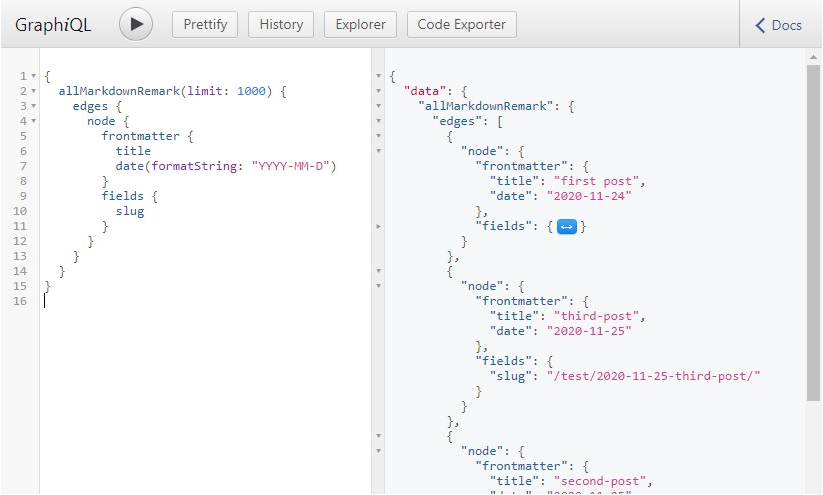

`http://localhost:8001/` 에서 `GraphQL` 쿼리를 테스트해볼 수 있다.




## 쿼리 작성

아래는 이전에 페이지를 생성하는데 사용하였던 `gatsby-node.js` 파일이다.
코드의 기능은 아래 두개로 요약 할 수 있을 것 같다.

  - 페이지를 자동으로 생성하기 위해 `slug`라는 필드를 새로 생성하였다. 
  - 쿼리로 탐색한 각 파일에 대해 설정된 슬러그로 페이지를 생성하였다.


```js
// gatsby-node.js

const { createFilePath } = require(`gatsby-source-filesystem`)

exports.onCreateNode = ({ node, getNode, actions }) => {
  const { createNodeField } = actions
  if (node.internal.type === `MarkdownRemark`) {
    const slug = createFilePath({ node, getNode, basePath: `pages` })
    createNodeField({
      node,
      name: `slug`,
      value: slug,
    })
  }
}

exports.createPages = async function ({ actions, graphql }) {
  const { data } = await graphql(`
      query {
        allMarkdownRemark {
          edges {
            node {
              fields {
                slug
              }
            }
          }
        }
      }
    `)
  data.allMarkdownRemark.edges.forEach(edge => {
    actions.createPage({
      path: edge.node.fields.slug,
      component: require.resolve(`./src/templates/post.js`),
      context: { slug: edge.node.fields.slug },
    })
  })
}
```