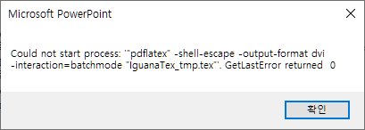
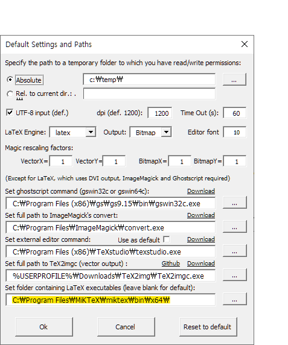

## Install

[이구아나 텍스 (IguanaTEX)](http://www.jonathanleroux.org/software/iguanatex/) 플러그인은 Windows PowerPoint에서 LaTeX 추가기능을 사용할 수 있도록 해준다. (무료)

링크에 연결된 페이지에서 다운로드 방법과 사용 방법을 확인할 수 있다.

## Error

##### Error 1

`Could not start process: "pdflatex" -shell -escape -output..`

##### 해결

1. power point 창 상단에서 "Iguana Tex" 를 클릭한다.

2. "Main Settings" 를 클릭한다.

3. 하단 입력창에 `pdfLaTeX.exe`가 있는 경로를 적어준다.

   

>  pdfLaTeX 실행 경로를 넣어줘야 오류를 해결하는데 설치한 적도 없었다. 
>
> pdfLaTeX 가 없다면 [MiKTeX](https://miktex.org/) 에서 다운받을 수 있다.

-----

reference

- https://tex.stackexchange.com/questions/483797/iguanatex-error-about-latex